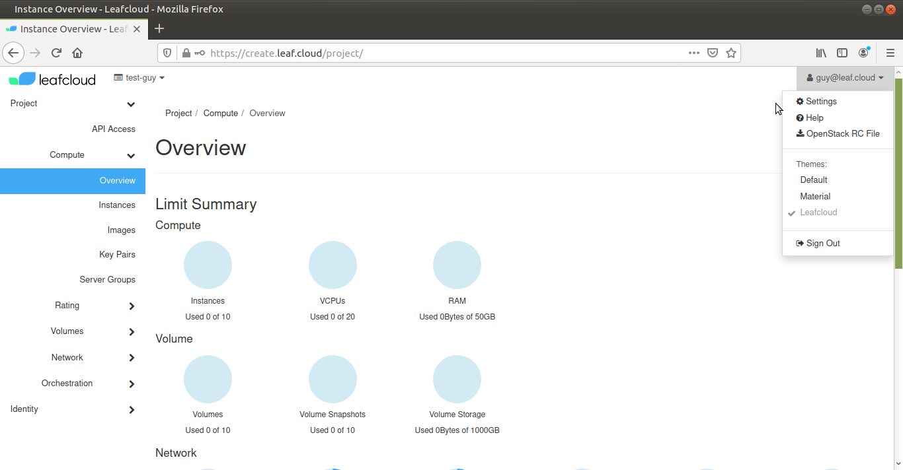
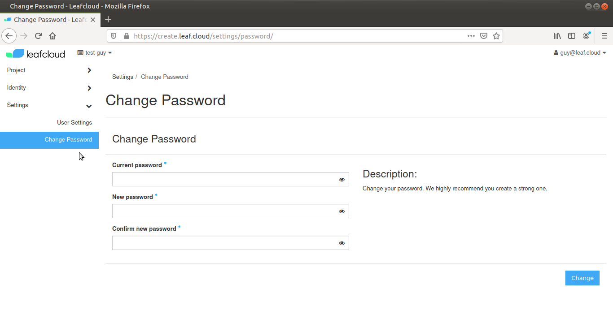

# How to change your password

This step by step guide will explain how to change the password of your Leafcloud account
 
Click on your user name, you can find this at the top righthand corner of the home screen.

In the dropdown menu, select *Settings*. 

Select *Change Password*, in the menu on the left.

Enter your old password, then select a new password and hit *confirm*.

When your password has been successfully updated, you will be redirected to the login page.

You can now log in to your Leafcloud account with your new password.