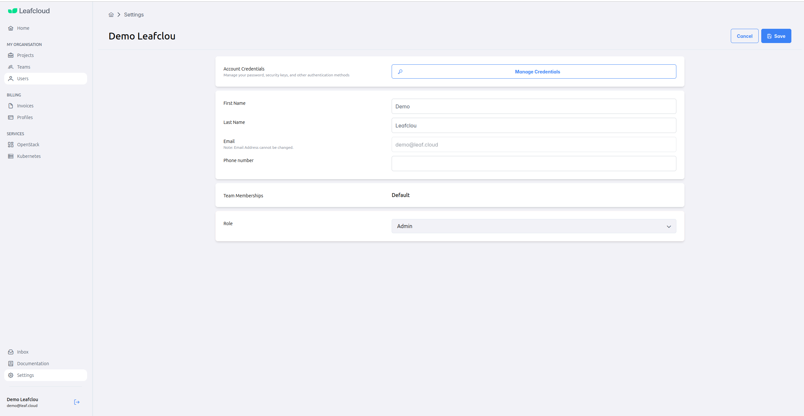
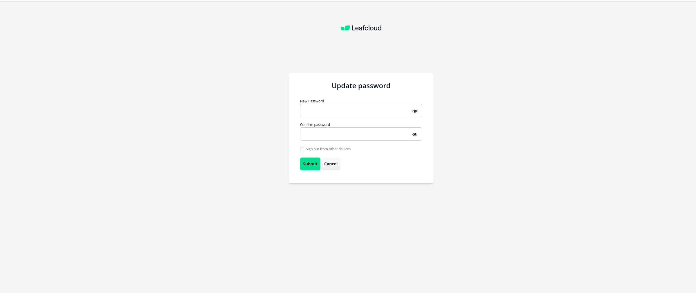
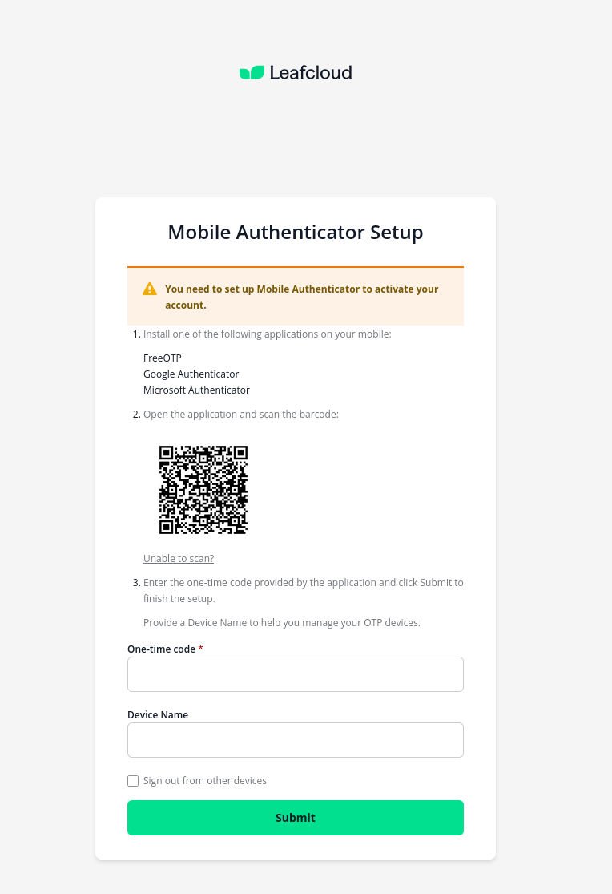
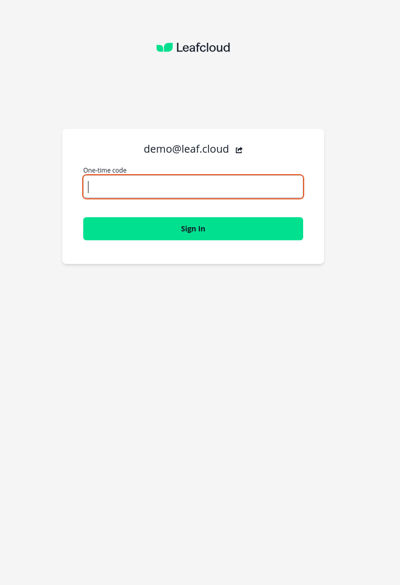
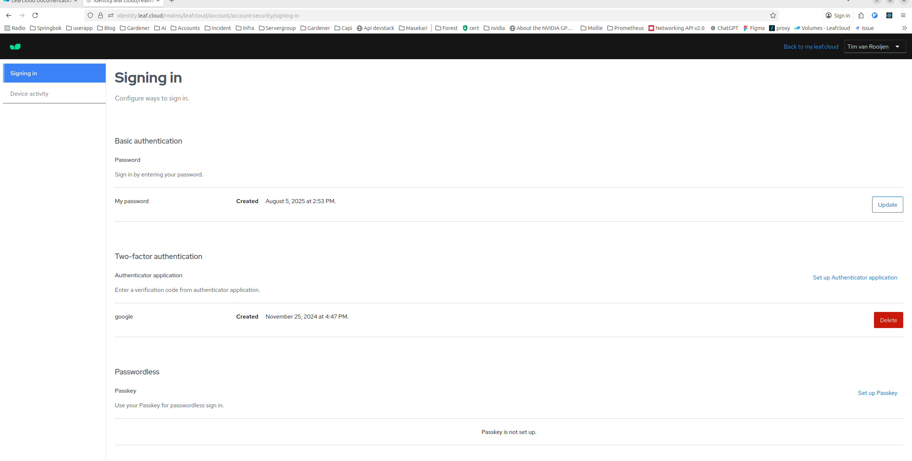
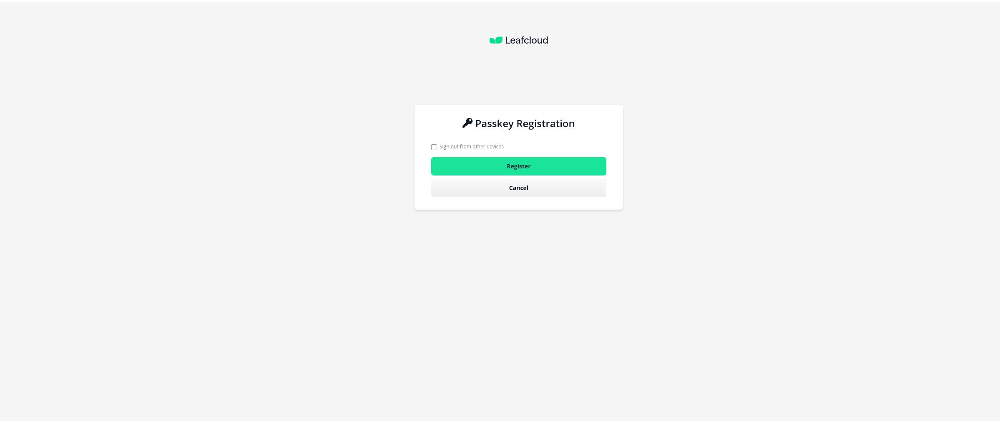

# Account Security & Authentication

Leafcloud provides multiple authentication methods to secure your account. You can manage your password, set up two-factor authentication (2FA), and configure passwordless login using passkeys.

## Accessing Account Security Settings

There are two ways to access your account security settings:

### Option 1: Via my.leaf.cloud

1. Log in to [my.leaf.cloud](https://my.leaf.cloud)
2. Navigate to **Settings** in the left sidebar
3. Click the **Manage Credentials** button in the Account Credentials section

This will redirect you to the Keycloak account security page.

### Option 2: Direct Access

You can also access the account security page directly at:  
[https://identity.leaf.cloud/realms/leafcloud/account/account-security/signing-in](https://identity.leaf.cloud/realms/leafcloud/account/account-security/signing-in)

## Managing Your Password

### Updating Your Password

From the account security page, you can update your password:

1. In the **Basic authentication** section, click the **Update** button next to "My password"
2. Enter your new password and confirm it
3. Click **Submit**

### Resetting a Forgotten Password

If you've forgotten your password, click the **Forgot Password?** link on the login page at [my.leaf.cloud](https://my.leaf.cloud).

## Two-Factor Authentication (2FA)

Two-factor authentication (2FA) is **required** for all Leafcloud accounts. It adds an extra layer of security by requiring a verification code from your mobile device in addition to your password.

### First Login Setup

When you log in to Leafcloud for the first time, you'll be required to set up two-factor authentication:

1. **Install an authenticator app** on your mobile device. You can use:
    - Google Authenticator
    - Microsoft Authenticator
    - FreeOTP
    - Any other TOTP-compatible app
2. **Open the app and scan the QR code** shown on the setup screen
3. **Enter the six‑digit code** from the app and optionally provide a device name
4. Click **Submit** to complete the setup

### Logging In with 2FA

After setting up 2FA, you'll be prompted to enter a code from your authenticator app each time you log in:

Simply open your authenticator app, get the current code, and enter it to sign in.

### Managing 2FA

You can manage your two-factor authentication settings from the account security page (see [Accessing Account Security Settings](#accessing-account-security-settings)):

- View your configured authenticators in the **Two-factor authentication** section
- Add additional authenticators by clicking **Set up Authenticator application**
- Remove an authenticator by clicking the **Delete** button next to it

## Setting Up Passkey (Passwordless Login)

Passkeys provide a secure, passwordless way to sign in using biometric authentication (fingerprint, face recognition) or your device's security key.

### Requirements

- A compatible device with biometric authentication or security key
- A modern browser that supports WebAuthn (Chrome, Edge, Firefox, Safari)

### Setup Steps

1. Navigate to the account security page (see [Accessing Account Security Settings](#accessing-account-security-settings))
2. In the **Passwordless** section, click **Set up Passkey**
3. Follow your browser's prompts to register your device
4. You can optionally check "Sign out from other devices" during registration

Once set up, you can sign in to Leafcloud using your device's biometric authentication instead of entering a password.

### Benefits of Passkeys

- **More secure**: Passkeys are resistant to phishing and credential theft
- **More convenient**: No need to remember or type passwords
- **Faster**: Authenticate with a fingerprint or face scan

