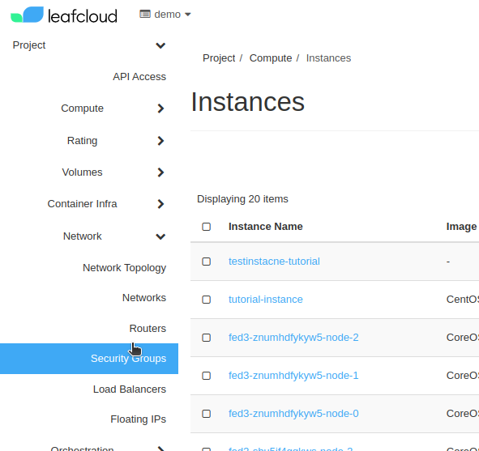
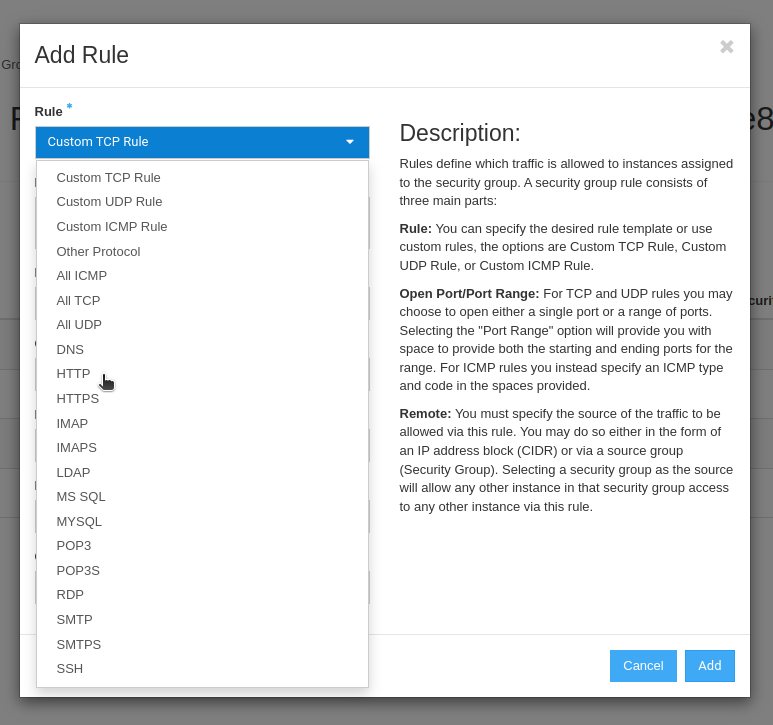

# Security Groups

This tutorial will walk you through Security Groups and IP rules

## Create Security Group

Configuring your security groups allows you to determine what traffic can access which port on your instance

In the web interface go to [Project > Network > Security Groups](https://create.leaf.cloud/project/security_groups)

Now click on *Create Security Group* on the right of your screen, then give your security group a name and click on *Create Security Group* in this new frame

### Enabling HTTP and HTTPS

In this tutorial we will add rules to your security group that will enable HTTP and HTTPS access to your instance

In the web interface go to [Project > Network > Security Groups](https://create.leaf.cloud/project/security_groups)

The available security groups for this project are now displayed, find the group you just created and click *Manage Rules* on the right

Click on *Add Rule*

Select *HTTP* from the Rule dropdown list, make sure the Remote is set to *CIDR* and fill in *0.0.0.0/0*

Click *Add*

You have now added a rule to the Security Group

click *Add Rule* again

Select *HTTPS* from the Rule dropdown list, make sure the Remote is set to *CIDR* and fill in *0.0.0.0/0*

click *Add*

You can now access your instance by HTTP and HTTPS
