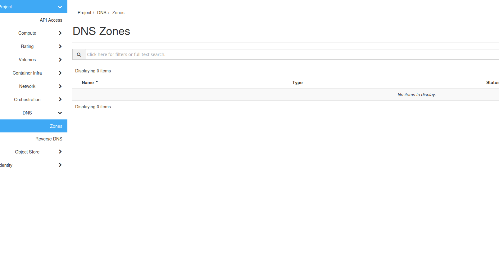
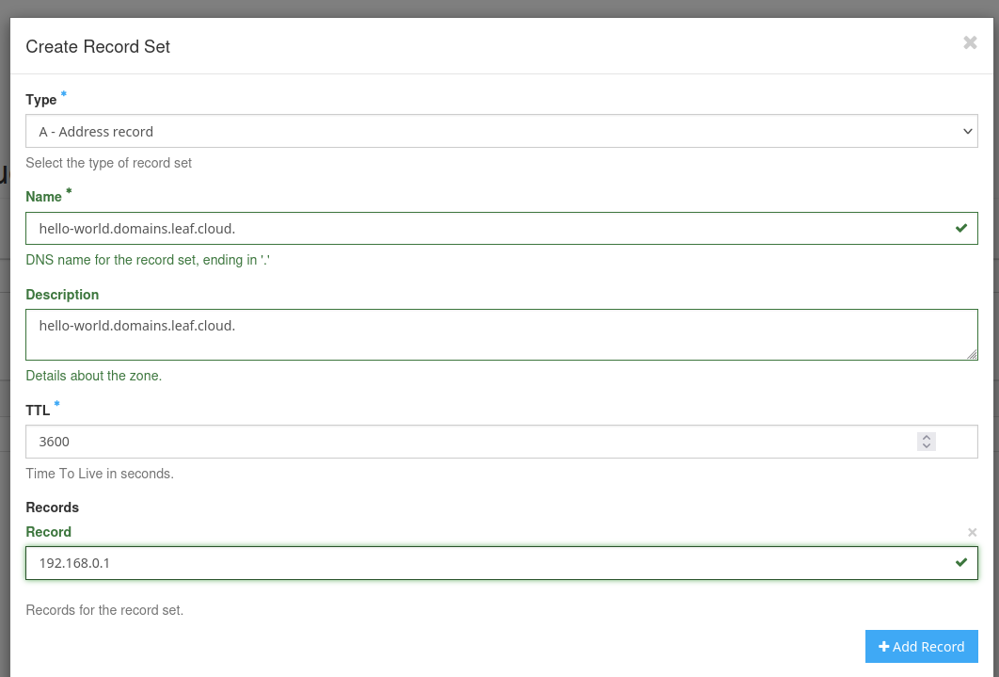
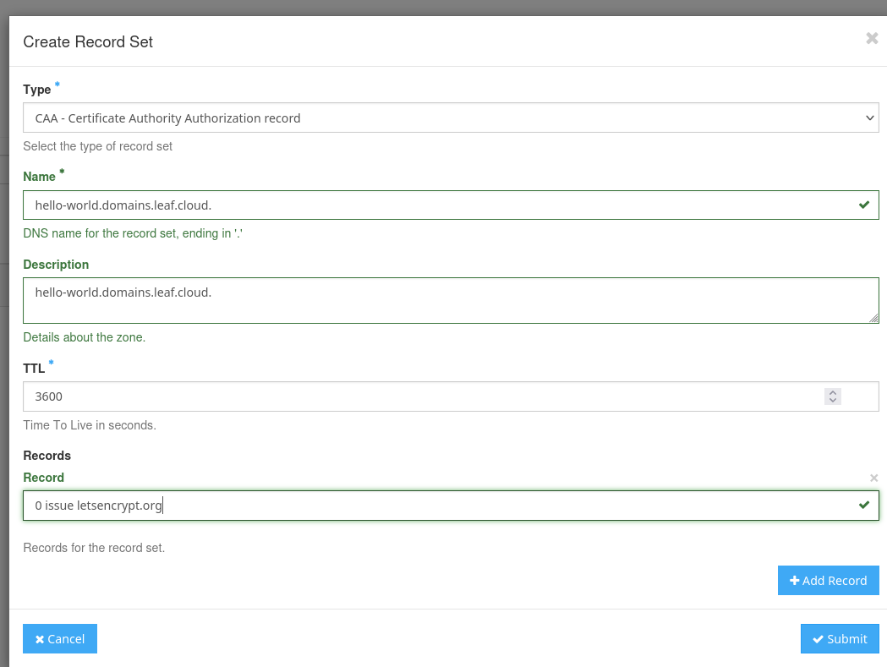

# Creating DNS Records

This tutorial guides you through the process of creating a subdomain under the domain `domains.leaf.cloud` using the OpenStack Horizon interface.

Utilize this service is free, making it simple and cost-effective to manage your developmental tests under our main domain.

## Step 1: Access DNS Management

Navigate to the DNS management section by following these steps:

- Open the OpenStack dashboard.
- Go to `DNS > Zones` at [DNS Zones Management](https://create.leaf.cloud/project/dnszones).

## Step 2: Create a New DNS Zone for Your Subdomain

In this step, you will create a DNS zone specifically for a new subdomain. This DNS zone will manage the DNS records for your subdomain, essentially serving as the administrative boundary for it.
Here’s how to create your DNS zone:

1. Click on **Create Zone** on the right side of the screen.
2. Fill out the fields in the **Create Zone** dialog:
   - **Name**: `hello-world.domains.leaf.cloud.` (Note the period at the end of the domain name. In DNS configuration, this period signifies that the domain name is fully qualified, meaning it is complete and absolute. OpenStack requires this format to ensure there is no ambiguity in the DNS hierarchy.)
   - **Email**: Enter the administrative contact email. This should be the email of the person or group managing this domain.
   - **Type**: Select 'Primary' if you are setting up the main DNS records yourself. Choose 'Secondary' if the zone will be a copy, relying on another primary zone for updates.
3. Click **Create Zone** to finalize the creation.

By completing these steps, you will have created a new DNS zone for `hello-world.domains.leaf.cloud.` This will allow you to manage DNS records specifically for this subdomain. Remember to replace `hello-world` with your desired subdomain name.

## Step 3: Verify DNS Zone Creation

To ensure that the subdomain is properly set up, follow these steps:

1. Return to the `DNS > Zones` page in the Horizon dashboard.
2. Search for `hello-world.domains.leaf.cloud` to verify that it appears in the list. Check its status, which should change to 'Active' within a few minutes if everything is configured correctly.

## Step 4: Configuring DNS Records

To make the subdomain functional, configure its DNS records by following these steps:

1. Select your new DNS zone from the list and click **Create Record Set**.
2. To add an A record pointing to your server's IP address:
   - **Record Type**: A
   - **Name**: `hello-world.domains.leaf.cloud.` (Make sure to include the final period, indicating a fully qualified domain name.)
   - **IP Address**: Enter the IP address of your server.
   - **TTL (Time to Live)**: Enter the TTL value, which determines how long (in seconds) this record should be cached by DNS resolvers before it needs to be refreshed. Common values are 3600 (one hour), 86400 (one day), etc. Choose a value based on how frequently you expect updates might be needed.
3. Click **Submit** to save the DNS record.

## Step 5: Adding a CAA Record for Let's Encrypt (Optional)

If you plan to use Let's Encrypt to obtain SSL certificates for your subdomain, it's advisable to add a CAA (Certificate Authority Authorization) record. This record allows you to specify which certificate authorities (CAs) are permitted to issue certificates for your domain. Adding a CAA record enhances the security by limiting which CAs can issue certificates for your domain.

Follow these steps to add a CAA record:

1. Select your DNS zone from the list and click **Create Record Set**.
2. To add a CAA record allowing Let's Encrypt to issue certificates:
   - **Record Type**: CAA
   - **Name**: `hello-world.domains.leaf.cloud.` (Ensure to include the final period to signify a fully qualified domain name.)
   - **Value**: `0 issue "letsencrypt.org"`
   - **TTL (Time to Live)**: Enter a TTL value, typically 3600 (one hour) or 86400 (one day), depending on how often you expect to update your CAA records.
3. Click **Submit** to save the CAA record.

## Conclusion

You have successfully created a subdomain `hello-world.domains.leaf.cloud` on OpenStack Horizon. Your subdomain is now configured and should be propagating across the internet. Replace `hello-world` with your subdomain
