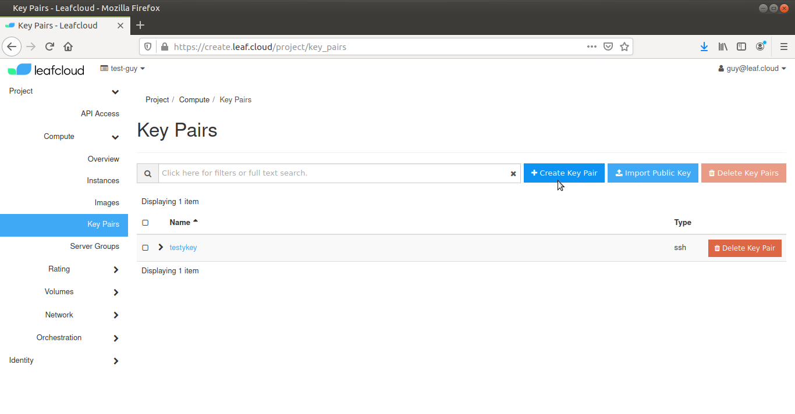
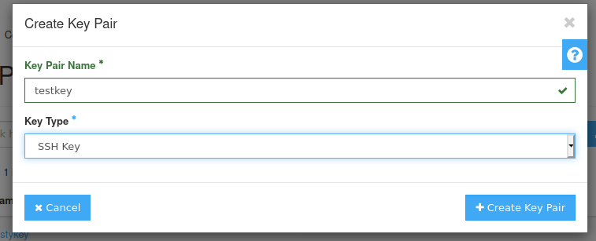
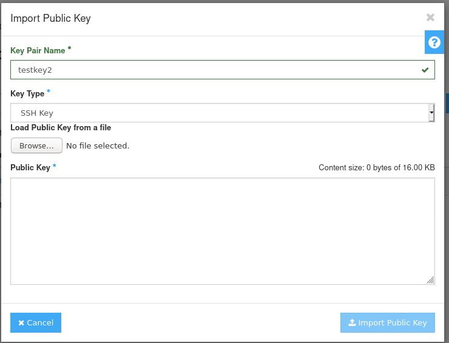

# Key Pairs

Key pairs consist of two keys: a 'public' and a 'private' key, these ensure that traffic to and from your instance is encrypted through SSH. 
You can use a single key pair for multiple instances concurrently.

### Making a new key pair

Navigate to *Compute > Key Pairs*

Click on *Create Key Pair*

Give your new key a name and select *SSH* from the *Key Type* dropdown list. For our example, we'll use an SSH type

Click on *Save Key Pair* and save your key in a secure location on your device

You have now created a new Key Pair

### Using an existing pair

Navigate to *Compute > Key Pairs*

Click on *Import Public Key*

Give your key a name and select the type from the dropdown menu, then click on *Choose File* and open the key file you wish to use

Click on *Import Public Key*

You have now imported your existing key
