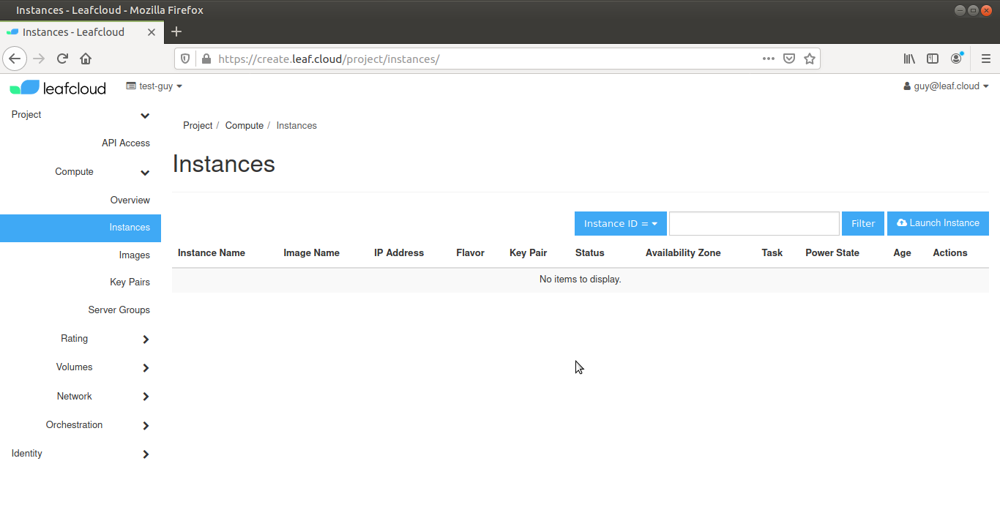
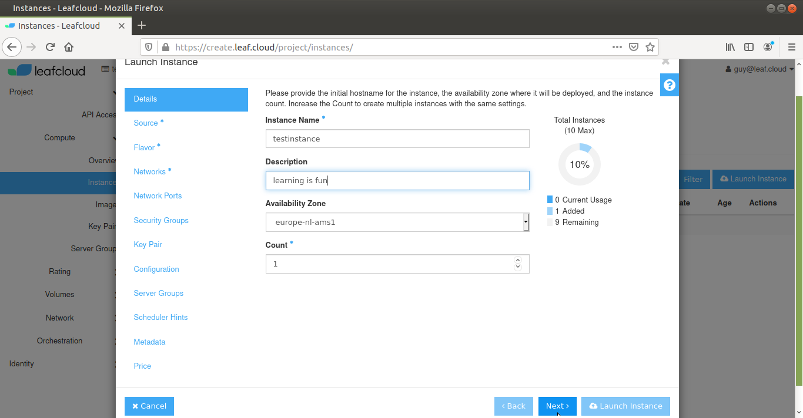
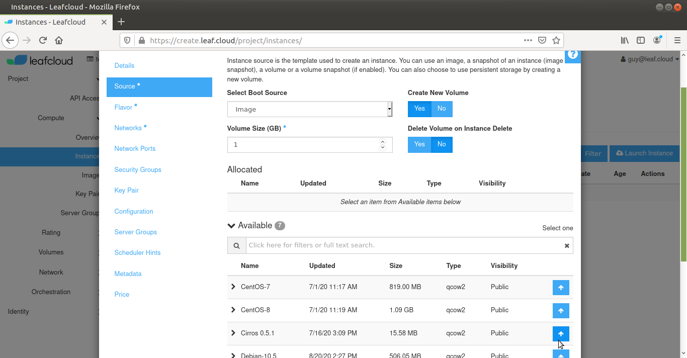
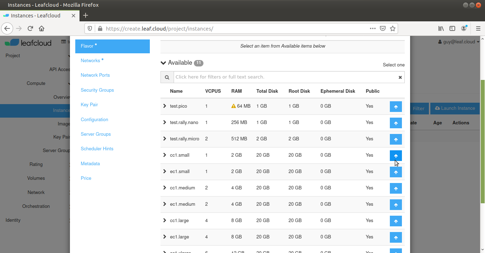
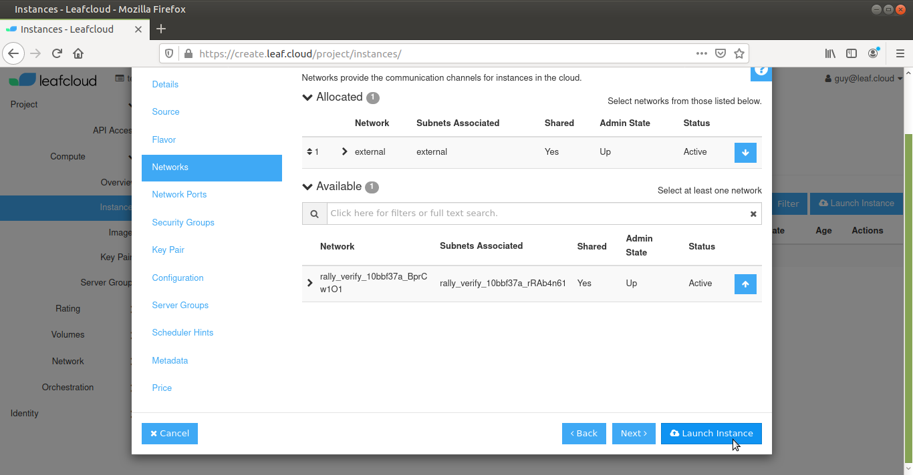
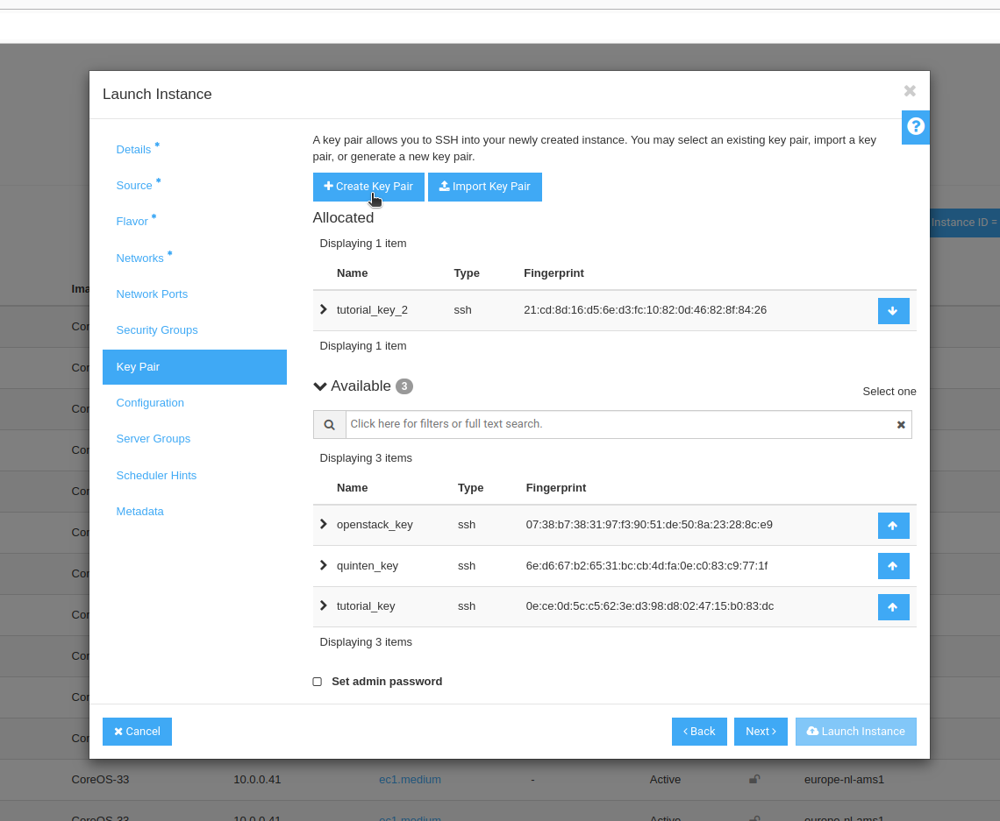

# How to launch an instance

In this tutorial we'll work through setting up a Leafcloud instance.

## Login to OpenStack

First, log in to the OpenStack dashboard at [create.leaf.cloud](https://create.leaf.cloud)

Once logged in, navigate to *Compute*, then click on *Instances*



Click on *Launch Instance*, on the center right

### Details

Give your instance a unique name (ie. testinstance) and add a description.

The *Availability Zone* is the region where the instance will be deployed, the *Count* setting allows you to create multiple instances with the same settings, for the purpose of this tutorial make sure it is set to 1



Click on *next*

### Source

In this tutorial we will create a new volume and boot from a specific image.

Make sure your settings are as follows:

Boot Source: Image, check to make sure that *Create New Volume* is selected

Volume Size: 10GiB, check if *Delete Volume on Instance Delete* is **not** selected

Select *Ubuntu-20.04.1* by clicking the up arrow on the right 



Click on *next*

### Flavor

This is the type of server used to host your instance. 

Select *ec1.small*, by clicking on the up arrow on the right. These *ec* sites are servers located at one of our Leaf-sites, where server heat is re-used locally



Click *next*

### Networks

Here you can determine on which channels the instance will be reachable.

Select *external*, this gives your instance a public IP address



Click *Launch Instance* at the bottom of the frame, you have now started your instance

### Key Pair

Here you can add a key pair to access your instance.

You can either Create a new key pair, import one from your computer or select one of the key pairs you've already added to openstack (under 'Available').

The next few steps will guide you through creating a new key pair, if you've already added one you can click on *Launch Instance* at the bottom of the frame.

Click on *Create Key Pair* at the top of the frame



Now give your key pair a name and select SSH as the Key Type

Now click on *Create Key Pair* in this new frame, this will create a new key pair and will show the new private key

You want to copy the private key and paste it in a new text file on your computer

Now type:
``` shell
chmod 600 <path to the key file>
```
This will secure the file so that you can you it to log in.

Now go back to the web interface and click *Done* on the bottom right corner of the frame

You've added the new key pair and you are ready to launch the instance

Click *Launch Instance* at the bottom of the frame, you have now started your instance
