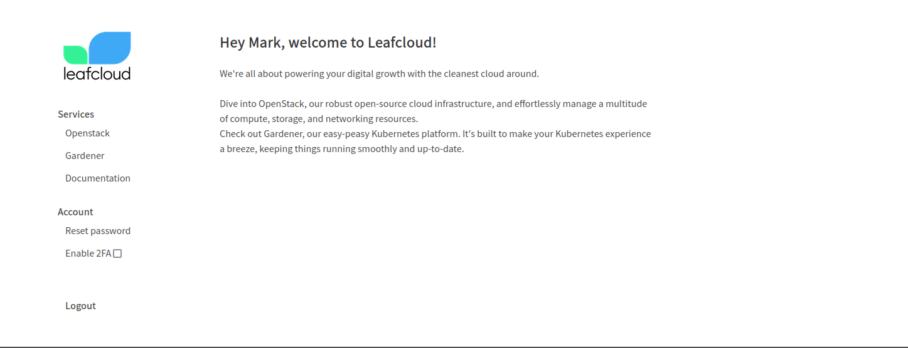
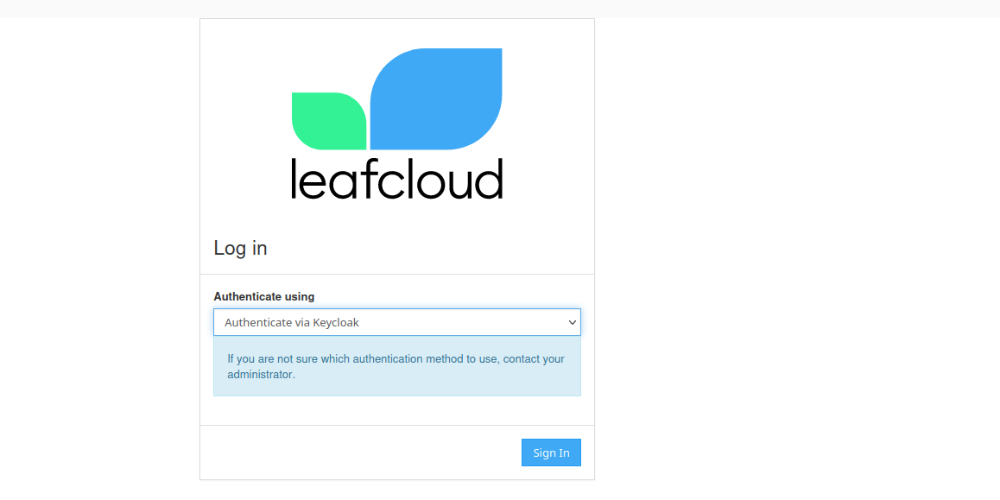
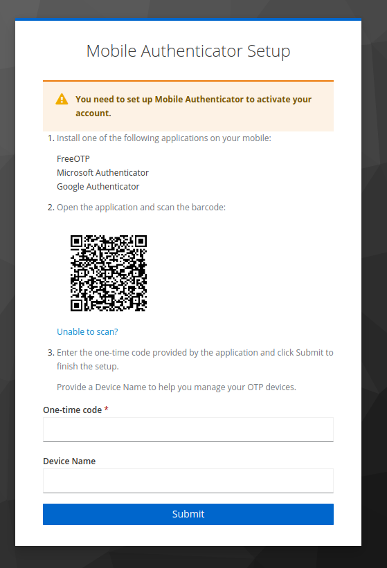

# How to Enable 2-Factor Authentication (2FA) for OpenStack

This step-by-step guide will show you how to enable 2FA for your OpenStack account, enhancing the security of your access.

## Step 1: Log into Your User Dashboard

First, access your user dashboard by navigating to:

[https://users.leaf.cloud](https://users.leaf.cloud)

## Step 2: Enable 2FA in Your Account Settings

- Within your account settings, locate and check the box labeled **"Enable 2FA"** to begin the setup process.

## Step 3: Access Your OpenStack Dashboard

Proceed to your OpenStack dashboard by visiting:

[https://create.leaf.cloud](https://create.leaf.cloud)

## Step 4: Select Authentication Method

- From the dropdown menu titled **"Authenticate using,"** choose the **"Authenticate using Keycloak"** option.

- Click the **"Sign in"** button.

## Step 5: Keycloak Authentication

- Enter your credentials into Keycloak. If this is your first time setting up 2FA, you will be prompted to configure it for your account.

## Step 6: Choose an Authenticator App

For the 2FA setup, you can use one of the following authenticator apps:

- FreeOTP
- Microsoft Authenticator
- Google Authenticator

## Step 7: Scan QR Code and Enter Code

- Scan the displayed QR code with your chosen authenticator app.

- Enter the numeric code provided by the app into the **"One time code"** text field.

## Completion

Upon entering the correct code, 2FA will be successfully configured for your account. Please note, with 2FA enabled, you will no longer be able to use the Keystone authentication method for logging into OpenStack.
