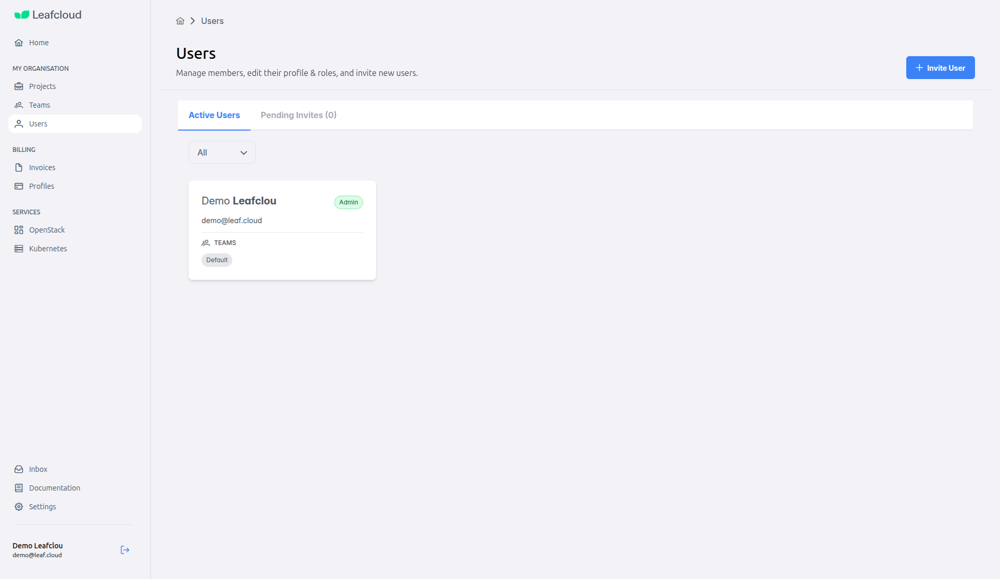
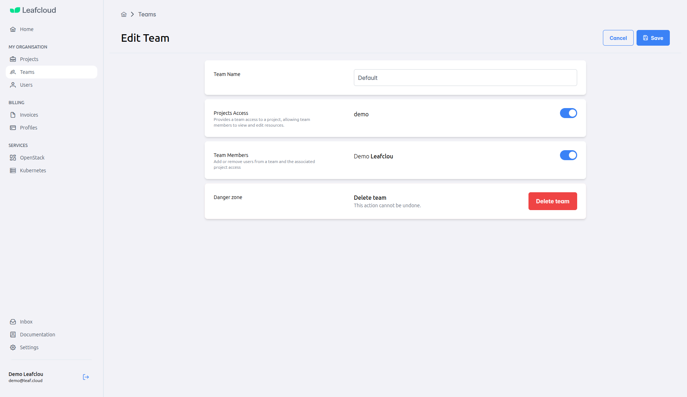

# Teams & Access Control

Teams control who can access your OpenStack projects. After signup, you have a default team where you're the admin. This guide shows you how to invite users and organize access with teams.

---

## How Teams Work

- **Users** need to be invited to your organization
- **Teams** get access to specific projects
- **Members** of a team can work in those projects

---

## Example: Creating a Team for Your Dev Environment

Let's say you want to create a separate development team that only has access to your dev project.

### Step 1: Invite Your Team Members

1. Go to **[my.leaf.cloud](https://my.leaf.cloud)**
2. Click **"Users"** in the sidebar
3. Click **"Invite User"**
4. Enter their email and select their role:
   - **Admin** - Full control (billing, teams, all projects)
   - **Member** - Can work in assigned projects only

They'll receive an email invitation to join.

### Step 2: Create the Development Team

1. Go to **"Teams"** in the sidebar
2. Click **"Create Team"**
3. Give it a name (e.g., "Development Team")
4. In **Projects Access**, toggle ON the projects this team should access
5. In **Team Members**, toggle ON the users who should be in this team
6. Click **"Save"**

That's it! Everyone in the Development Team can now access the development project in OpenStack.

---

## Editing Team Access

To change which projects a team can access:

1. Go to **"Teams"** and click on the team
2. Toggle projects **ON** or **OFF** in the **Projects Access** section
3. Click **"Save"**

To add or remove team members:

1. Open the team
2. Toggle users **ON** or **OFF** in the **Team Members** section  
3. Click **"Save"**

---

## User Roles

**Admin**  
Full control - can manage everything including billing and teams

**Member**  
Can create and manage resources in assigned projects only

---

## Next Steps

Now that you know how to manage your team:

- **[Launch Your First Instance →](Launching-an-instance.md)** - Start deploying virtual machines
- **[Configure Security →](Changing-your-password.md)** - Enable 2FA and manage authentication
- **[Using OpenStack CLI →](Using-Openstack-CLI.md)** - Automate tasks with command-line tools

---

## Need Help?

If you have questions about team management:

- **[Visit our FAQ](https://leaf.cloud/faq)** - Common questions answered
- **[Contact Support](https://leaf.cloud/contact)** - Email or call our support team

