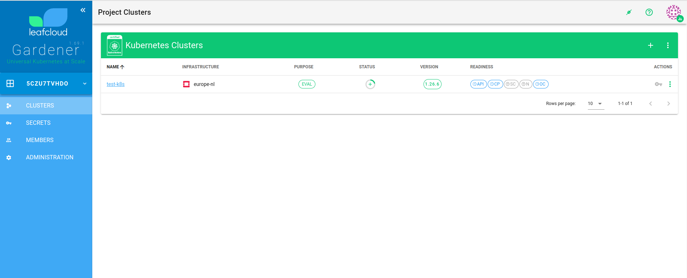
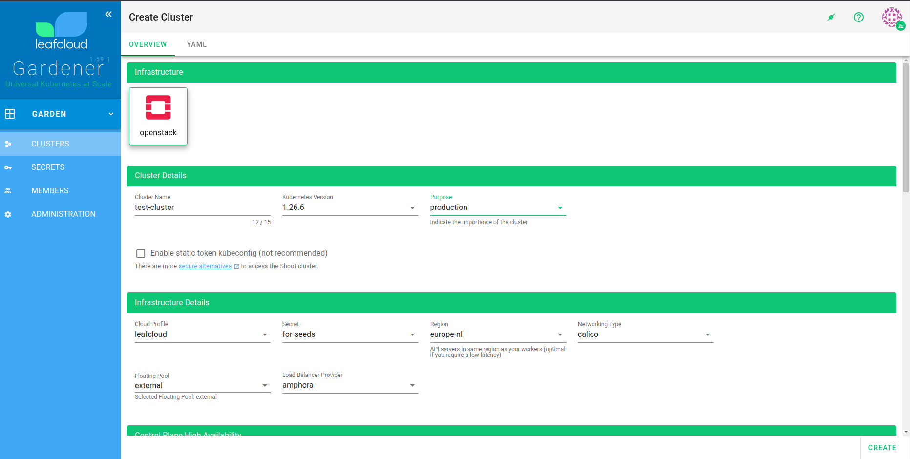
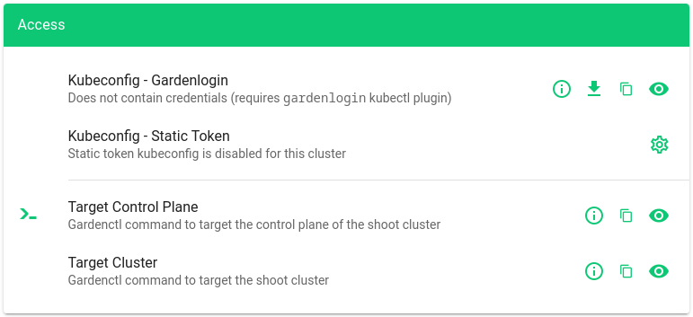

# Managed kubernetes with gardener

Gardener Kubernetes is our managed Kubernetes service that helps with the deployment, management, and scaling of Kubernetes clusters within your cloud environment. The master nodes are hosted on our dedicated infrastructure, providing reliable control plane services, while the worker nodes can be dynamically provisioned within your own OpenStack project.

Gardener Kubernetes offers a user-friendly dashboard for those who prefer a graphical interface, making it easy to manage your clusters with just a few clicks. However, for those who like more control, everything can still be managed through YAML files, allowing you to specify precise configurations declaratively.

Currently, Gardener is still in beta. If you want to start using this new managed Kubernetes platform, send an email to [support@leaf.cloud](mailto:support@leaf.cloud).


## Creating a Kubernetes Cluster

In your browser, open the [Gardener dashboard](https://dashboard.gardener.leaf.cloud). Use the same sign-in credentials as you would on [create.leaf.cloud](https://create.leaf.cloud).

To begin the creation of a new Kubernetes cluster through the Gardener dashboard, follow these steps:

1. **Access the Cluster Menu:**
   - Navigate to the main menu of the Gardener dashboard.
   - Click on the `Clusters` option to view the existing clusters.




2. **Initiate Cluster Creation:**
   - Click on the '+' icon, typically located at the top or bottom of the clusters list, to start the creation process.

3. **Configure Cluster Details:**
   - **Cluster Name:** Enter a unique, lowercase name for your cluster. Note that the cluster name cannot be changed once the cluster is created.
   - **Purpose:** Choose the intended purpose of the cluster. For instance, selecting 'Production' designates the cluster as critical and will automatically enable monitoring metrics.
   - **Container Network Interface (CNI):** Choose the CNI that best fits your cluster's networking and security needs:
       - **Calico:** A traditional default, offering high-performance networking and network policy enforcement.
       - **Cilium:** Leveraging the power of eBPF, Cilium provides advanced features such as:
           - Enabling highly granular network and application security policies administered based on Kubernetes-native constructs.
           - Offering extensive network visibility, including Layer 7 observability in terms of HTTP, gRPC, and Kafka protocols.
           - Efficient load balancing with direct server return (DSR) capabilities for improved network performance.
   - **Worker Pools:** Worker pools are groups of worker nodes that have the same configuration. You can define multiple worker pools with different machine types, allowing you to tailor the resources and processing power to the needs of different workloads within your cluster. Additionally, these pools can be configured to auto-scale, ensuring that your cluster adapts to workload demands efficiently and helps to optimize your resource utilization.
       - **Pool Name:** Give each worker pool a distinctive name to identify it within your cluster configuration.
       - **Machine Type:** Select the appropriate machine type that meets the performance and resource requirements for the workloads you plan to run.
       - **Size:** Define the number of nodes you want in this pool. You can usually adjust this later to scale the pool according to your demands.
       - **Additional Settings:** Depending on your requirements and the capabilities of your cloud environment, you might be able to set other parameters such as disk size, disk type, and specific network settings for each worker pool.




4. **Set Additional Options:**
   - Proceed to fill in the required fields and adjust any additional settings based on your needs. This may include network settings, node configurations, and other advanced options.

5. **Review and Create:**
   - After configuring the details, review all settings to ensure accuracy.
   - Click the `Create` button to initiate the provisioning of your new Kubernetes cluster.

The creation of the cluster might take around 6 minutes. Once finished, you will be able to manage your cluster directly from the dashboard. Additionally, upon logging into your OpenStack dashboard, you'll observe the instances corresponding to your worker pools up and running in the 'Instances' section, along with the network and router configurations that have been automatically set up.


# Accessing Your Kubernetes Cluster

Once your cluster is up and running, accessing it securely is the next step. There are two primary methods to authenticate and interact with your cluster: using a static token or through `gardenctl` login.

## Static Token
Use a static token for a quick and direct connection to your Kubernetes cluster. This approach is ideal for scripts and CI/CD pipelines.

Follow these steps to use a static token for accessing your Kubernetes cluster:

1. **Enable Static Token**
   - Navigate to the cluster details screen in the Gardener dashboard.
   - Go to the `Access` tab, then find the `Kubeconfig` section.
   - Click on `Static Token` and select `Edit` to enable it.
   - After enabling `Static Token` it will take some time before this is applied.

2. **Download Kubeconfig File**
   - Once the static token is enabled, a `.kubeconfig` file will be available for download.
   - Download the `.kubeconfig` file to your local machine.

3. **Set Kubeconfig Environment Variable**
   - Open a terminal on your machine.
   - Run the following command to set the `KUBECONFIG` environment variable, replacing `~/Downloads/downloaded-kubeconfig.yaml` with the path to your downloaded file:
     ```shell
     export KUBECONFIG=~/Downloads/downloaded-kubeconfig.yaml
     ```
   - With the `KUBECONFIG` environment variable set, you can now use `kubectl` to interact with your cluster.



## Gardenctl Access

For secure and dynamic access to your Kubernetes clusters, use `gardenctl`. Here's how to set it up:

### Install Gardenlogin
   - Follow the [installation instructions](gardenctl.md) to install `gardenlogin` on your local machine.

### Target Your Cluster
   - Open a terminal and use the `gardenctl` command to target your cluster:
     ```shell
     gardenctl target --garden leafcloud-production --project <project-id> --shoot <cluster-name>
     ```
   - Replace `<project-id>` with the code found in the main menu of the Gardener dashboard.
   - Replace `<cluster-name>` with the name of your Kubernetes cluster.
   - `leafcloud-production` is the identity specified in your `gardenctl-v2.yaml` file.

### Browser Authentication
   - When you target your cluster using the `gardenctl` command, a browser session will automatically open for authentication.
   - Follow the on-screen instructions in the browser to authenticate and grant access.
   - After successful authentication, the browser will confirm that you can close the window and return to the terminal to manage your cluster with `gardenctl`.

## Managing Shoots Declaratively with `gardenctl`

In the Gardener system, user clusters are referred to as "Shoot" clusters. `gardenctl` simplifies the management of these clusters by allowing you to interact with them using declarative configurations. This approach aligns with the Kubernetes philosophy of declaring the desired state of your resources in a YAML format.

### Prerequisites
Before you begin, ensure you have the `gardenctl` CLI tool installed and configured as described in the earlier sections.

### Steps for Declarative Shoot Management

1. **Target the Garden**
   Before you manage your Shoots, target the appropriate Garden cluster:
   ```shell
   gardenctl target --garden prod-leaftest
   ```
2. To get a list of all your clusters run
   ```shell
   kubectl get shoots
   ```
3. You can view details of a single cluster by running
   ```shell
   kubectl get shoots my-cluster -o yaml
   ```
4. save it to a file
   ```shell
   kubectl get shoots my-cluster -o yaml > my-cluster.yaml
   ```