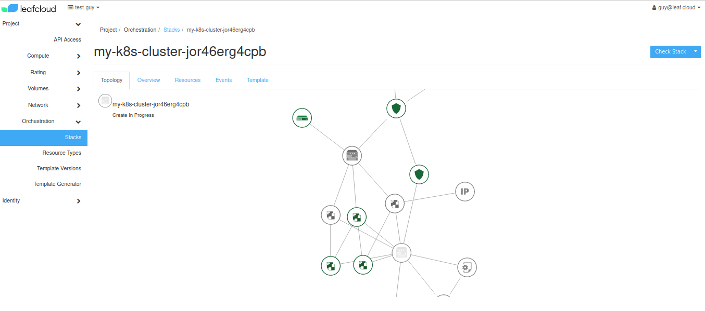

# Creating a Kubernetes cluster

This tutorial will guide you through the process of creating a new Kubernetes cluster, using the OpenStack CLI. Container clusters are deployed and managed by the OpenStack Magnum project. You can use these clusters to deploy reproducible high-availability services and infrastructures 

To get started, you'll need to have the OpenStack CLI set up: You can find a tutorial on how to do that in the *Getting Started* section

Additionally, you'll need the Kubectl. This allows you to deploy your applications as a cluster. Make sure it's the same version as used in the cluster you are deploying:

```
sudo snap install kubectl --channel=1.18/stable --classic
```

## Configure the OpenStack CLI 

Inside your virtual env. install the magnum client:

```
pip install python-magnumclient 
```

Now check if you are able to reach the server list using OpenStack: 

```
openstack server list 
```
If you get an authentication error, run source again and make sure your password is correct

## Choose a template

 You can find a list of the various templates at: 
```
openstack coe cluster template list
``` 
 
Choose the one that best fits your needs. In this tutorial we'll be using:
`k8s-fedora-coreos-32-ha-octavia-ingress`

## Create a Cluster 

The template that we're going to use has support for:
- ingress load balancing based on octavia high availability load balancers.
- autoscaling using the kubernetes openstack autoscaler driver
- encrypted cinder volumes for both hosts and containers i.e. persistent volume claims 

We support our pre-configured templates, if you want to use custom templates or custom labels, you can, but it and it might not work and we're unable to support it.

```
openstack coe cluster create my-k8s-cluster --cluster-template k8s-fedora-coreos-32-ha-octavia-ingress
```

To check up on the installation enter the following: 

``` 
openstack coe cluster list 
``` 


When the status switches from CREATE_IN_PROGRESS to CREATE_COMPLETE the installation is complete and you can retrieve the config: 

```
openstack coe cluster config my-k8s-cluster
``` 

This will download a file called 'config' to the working directory. 

``` 
export KUBECONFIG=/home/user/dir/config 
```

The config is now usable by kubectl and you should be able to reach your cluster by entering: 

```
kubectl get nodes -o wide 
```
 
You have now created a kubernetes cluster using the CLI. 

Only the creator of a cluster can delete it by entering the following:

```
openstack coe cluster delete my-k8s-cluster
```
If you are no longer able to access the required account, contact leafcloud for support.