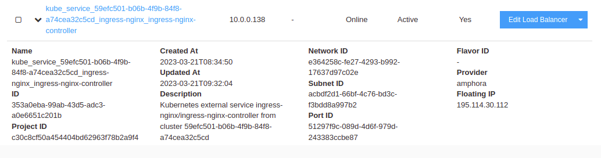

# Ingress with NGINX and Letsencrypt

In this tutorial you'll learn how to add an NGINX based ingress controller with Letsencrypt signing support on your Leafcloud Kubernetes cluster.

## Prerequisites

- [Kubernetes cluster](creating-a-kubernetes-cluster.md)
- [Helm](installing-helm.md)
- A domain that you own, with access to it's DNS record config for creating subdomains.

## Installing ingress-nginx

For the ingress controller we'll use the [ingress-nginx](https://github.com/kubernetes/ingress-nginx) helm chart

```
helm repo add ingress-nginx https://kubernetes.github.io/ingress-nginx
helm repo update
helm -n ingress-nginx install ingress-nginx ingress-nginx/ingress-nginx --create-namespace
```
## Installing certmanager

For singing we'll use the [cert-manager](https://cert-manager.io/docs/installation/helm/) helm chart.

```
helm repo add jetstack https://charts.jetstack.io
helm repo update
helm install \
  cert-manager jetstack/cert-manager \
  --namespace cert-manager \
  --create-namespace \
  --version v1.11.0 \
  --set installCRDs=true
```

## Creating the ClusterIssuer

For issueing TLS certificates using Letsencrypt, we'll create a ClusterIssuer.
Create a file named `cluster-issuer.yml` with the following contents:
```
apiVersion: cert-manager.io/v1
kind: ClusterIssuer
metadata:
  name: letsencrypt-prod
spec:
  acme:
    # You must replace this email address with your own.
    # Let's Encrypt will use this to contact you about expiring
    # certificates, and issues related to your account.
    email: myemail@somedomainthatactuallyexisst.com
    server: https://acme-v02.api.letsencrypt.org/directory
    privateKeySecretRef:
      # Secret resource that will be used to store the account's private key.
      name: letsencrypt-account-key
    # Add a single challenge solver, HTTP01 using nginx
    solvers:
      - http01:
          ingress:
            class: nginx
```

To apply this configuration and create the ClusterIssuer in your Kubernetes cluster, you'll need to run the following command:
```
kubectl apply -f cluster-issues.yml
```

## Testing the ClusterIssuer


To test if the whole ingress+tls stack is working, we're going to deploy jupyter-hub to our cluster.

### Creating the DNS record

First thing's first. We're going to have to add a DNS record poingting to our NGINX ingress loadbalancer's public ip addrres.

To find the correct ip address you're going to use the Leafcloud web interface.
Go to:
https://create.leaf.cloud/project/load_balancer

Look for an item that looks similar to:
`kube_service_59efc501-b06b-4f9b-84f8-a74cea32c5cd_ingress-nginx_ingress-nginx-controller`

Do NOT confuse with one named similar to the following:
`kube_service_kubernetes_kube-system_ingress-nginx-controller`



Press the down-arrow to the left of the item, copy the `Floating IP` and configure your DNS A record in your DNS config, for example:
```
jupyterhubdemo:
  - type: A
    value: 195.114.30.112
```

Apply the config and `jupyterhubdemo.mydomain.eu` should be reachable and showing a 404 page.

### Installing jupyter hub

Create a file called `jupyter-hub-config.yml` with the following contents, replacing the domain with the one you've just configured:

```
ingress:
  enabled: true
  annotations:
    kubernetes.io/ingress.class: nginx
    cert-manager.io/cluster-issuer: letsencrypt-prod
    acme.cert-manager.io/http01-ingress-class: nginx
    kubernetes.io/tls-acme: 'true'
  hosts:
    - jupyterhubdemo.mydomain.eu
  tls:
    - secretName: jupyterhubdemo-tls
      hosts:
        - jupyterhubdemo.mydomain.eu
```

Run the helm chart:
```
helm repo add jupyterhub https://jupyterhub.github.io/helm-chart/
helm repo update
helm install jupyter-hub jupyterhub/jupyterhub --namespace jupyter-hub -f jupyter-hub-config.yml --create-namespace
```
