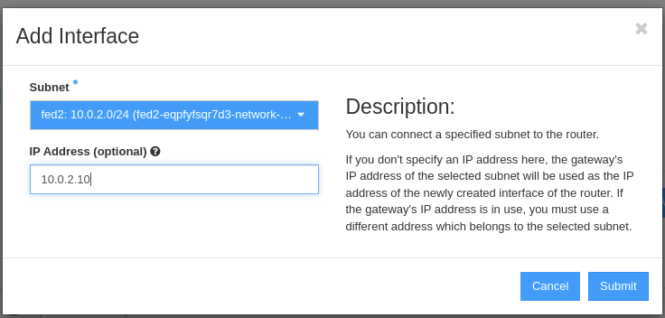
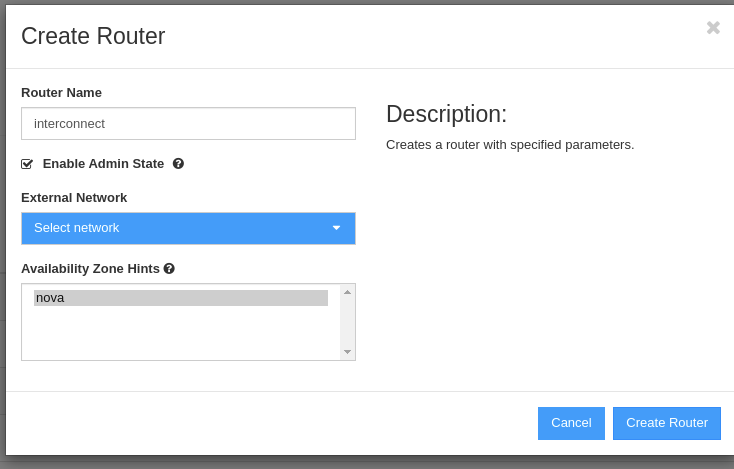
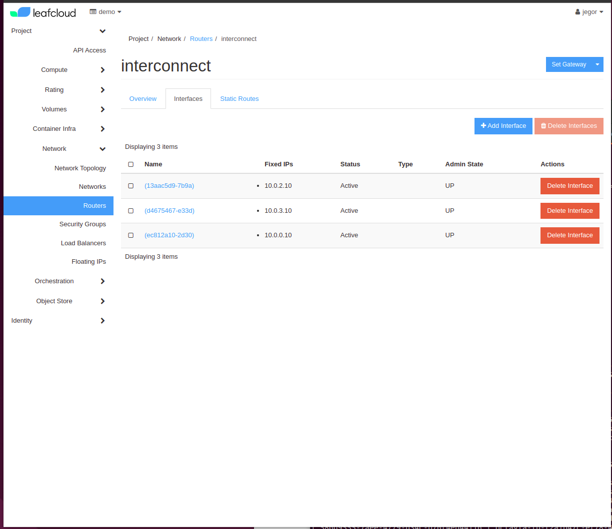
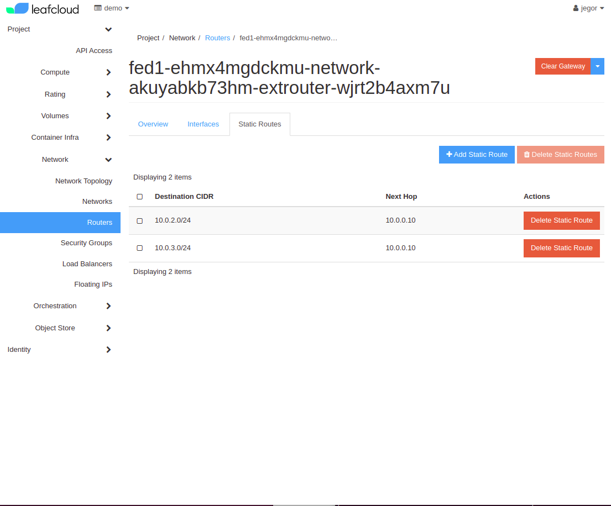
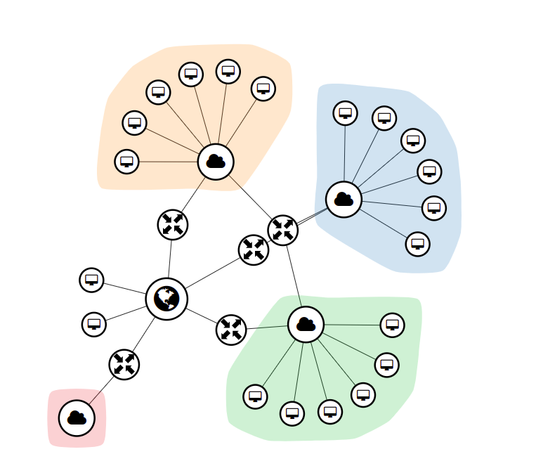

# Multicluster Kubernetetes

In this tutorial we are going to set up multiple interconnected Kubernetes clusters, for the purpose of doing multi-cluster application deployments.


## Deploying the clusters

We will need to set specific cidrs for each of the cluster's networks:


Cluster 1
```
openstack coe cluster create fed1 --cluster-template k8s-ha-v1.21.2-template-v2.0-rc3 --master-flavor ec1.medium --flavor ec1.medium --node-count 3 --master-count 3 --labels fixed_subnet_cidr=10.0.1.0/24 --keypair <keypair>
```

Cluster 2
```
openstack coe cluster create fed2 --cluster-template k8s-ha-v1.21.2-template-v2.0-rc3 --master-flavor ec1.medium --flavor ec1.medium --node-count 3 --master-count 3 --labels fixed_subnet_cidr=10.0.2.0/24 --keypair <keypair>
```

Cluster 3
```
openstack coe cluster create fed3 --cluster-template k8s-ha-v1.21.2-template-v2.0-rc3 --master-flavor ec1.medium --flavor ec1.medium --node-count 3 --master-count 3 --labels fixed_subnet_cidr=10.0.3.0/24 --keypair <keypair>
```


We will create a new router to interconnect the networks of out three clusters.



We create an interface for each of the networks on it



Your interconnect router will look something like:


Now we will add a static route to the interconnect router from each of the network's routers:



You will end up with an interconnected network topology like:


