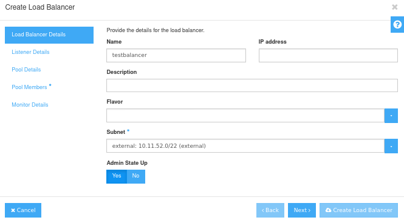
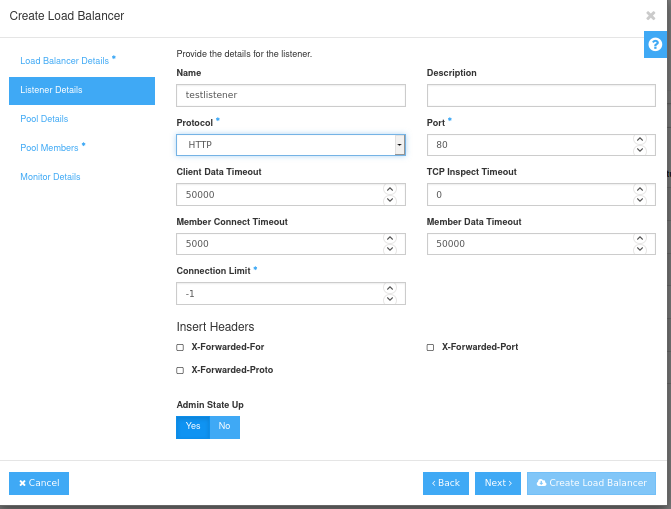
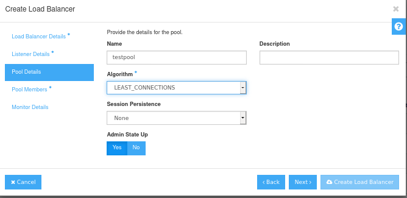
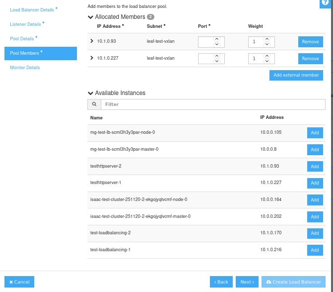
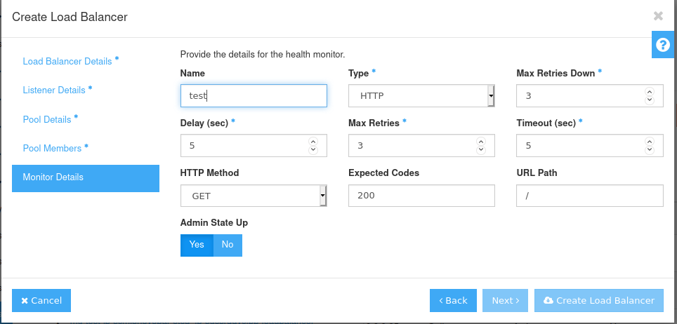

# Load Balancing

This tutorial will walk you through setting up a basic load balancer between two *http* instances.

For examples on deploying various types of load balancers using the OpenStack CLI, check out the OpenStack [*Basic Load Balancing Cookbook*](https://docs.openstack.org/octavia/pike/user/guides/basic-cookbook.html)

## Create a load balancer

Navigate to *Network > Load Balancers* and click on *Create Load Balancer*

### Load Balancer Details

Assign your load balancer a unique name and choose a *Subnet*, in this case *external*

Make sure *Admin State Up* is set to Yes and click *Next*

### Listener Details

Give your new *listener* a name, set the *Protocol* to *Http* and make sure the *Port* is now set to 80

### Pool Details

Give your new pool a name, choose the appropriate algorithm. In this tutorial we'll use *LEAST_CONNECTIONS*

Make sure *Admin State* is set to up, then click *Next*

### Pool Members

Add the instances you want to balance from the list and set the port to 80

Click *Next*

### Monitor Details

Give your health monitor a name, click on the *Type* dropdown menu and select *Http*. Adjust the default settings if needed 

Click on *Create Load Balancer*

You have now created your load balancer.
