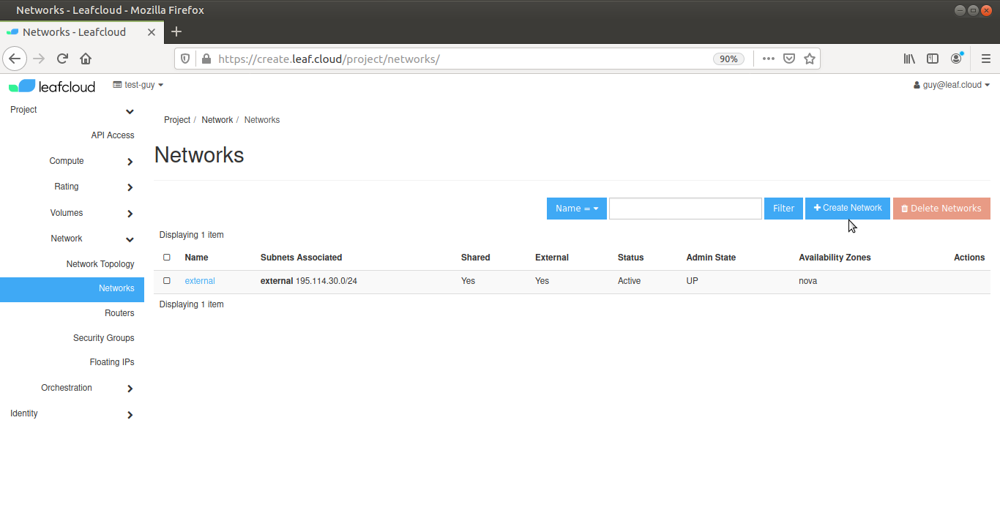
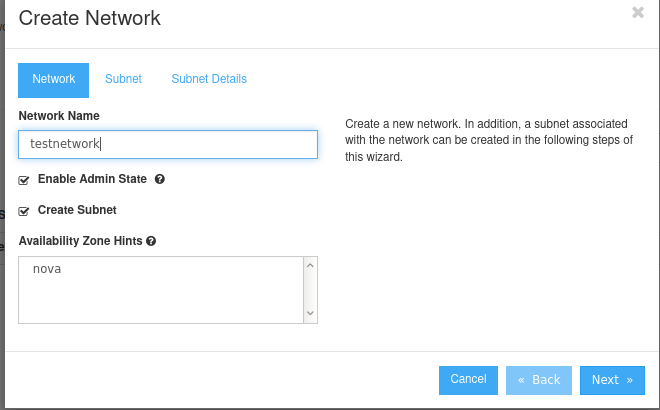
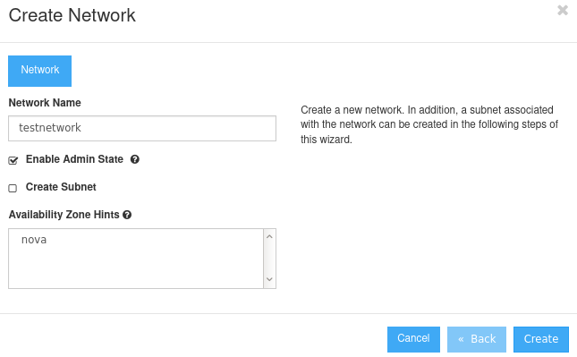

# Creating a new network

Navigate to *Network > Networks* 

Click on *Create Network*

### Network

Give your new network a name and if necessary, tick the *Create Subnet* box

In this tutorial we will also create a subnet, if you do not need a subnet, deselect the *Create Subnet* box and click *Create*. Otherwise, click *Next*  

### Subnet

Give your subnet a name and fill in the network address in the *Network Address* box, using the CIDR format (e.g., 192.168.0.0/24,2001:DB8::/48)

Choose an IP version and gateway IP

Leaving the *Gateway IP* box blank will use the default value. If you don't want to use a gateway, check the *Disable Gateway* box

Click *Next*

### Subnet Details

Here you can add additional attributes to the subnet if required

Add IP addresses to the *Allocation Pools* in the following way: [start_IP_address],[end_IP_address] (e.g., 192.168.1.100,192.168.1.120)

Add DNS name servers for your subnet in the *DNS Name Servers* box

Add additional routes to the host in the *Host Routes* box. Add entries as follows: [destination_cidr],[nexthop] (e.g., 192.168.200.0/24,10.56.1.254)  

Note that you can only add one entry per line 

Click on *Create*, you have now created your new network
