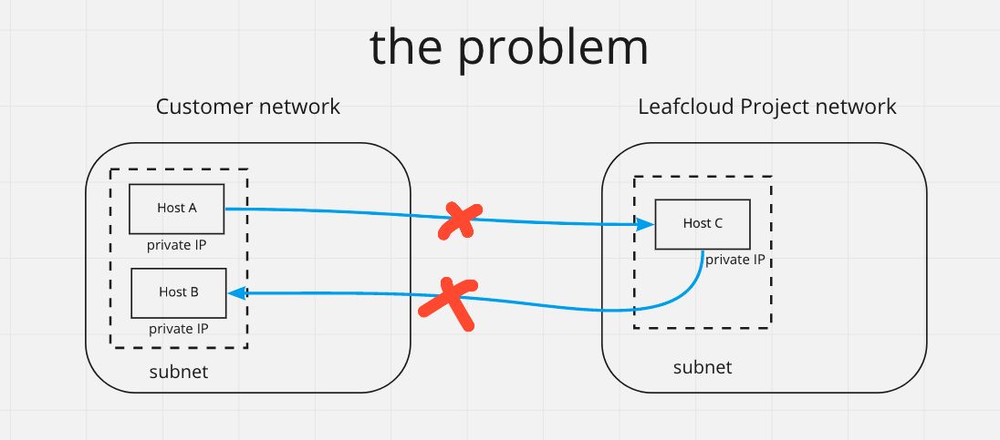
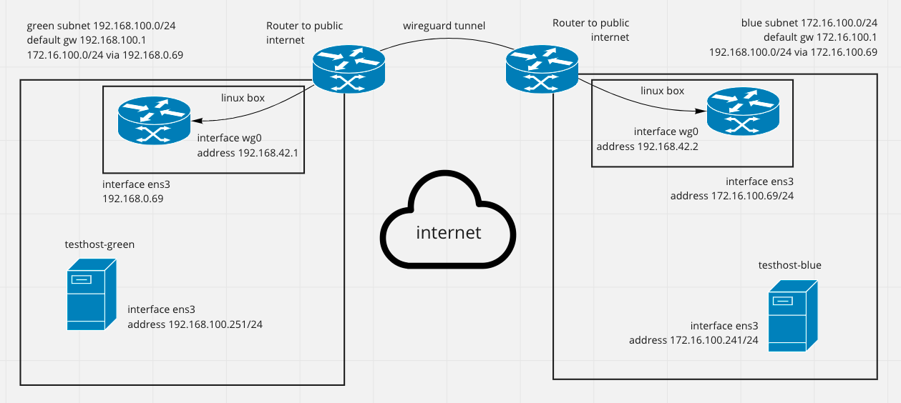

# Making a site to site VPN

The goal of this guide is to show you how to setup a secure tunnel between two different networks and setup routing such that all hosts from one side (subnet) can reach all hosts on the other side (subnet). 

The problem that a customer may face is that (s)he wants to use some services in an existing network but also utilize the benefits of Leafcloud. In secure networks generally a problem arises around how to make the new hosts in Leafcloud routable from the existing network and vice-versa. Typically there is no physical link between these sites, so a tunnel would need to be created to transit the public internet.



As this illustration shows the problem is that there is no route between hosts in the different networks.

## Welcome to the topic of Site to Site VPNs

We will cover the following topics:

1. Choosing the technology for setting up a tunnel over the internet
2. Setting up the router host
3. Setting up the tunnel
4. Setting up routing
5. Security

### 1. Choosing a technology for a tunnel over the internet 

**Choosing a protocol**

There are different technologies that you may use for setting up the tunnel that traverses the internet. IVPN has a good [side-by-side comparison](https://www.ivpn.net/pptp-vs-ipsec-ikev2-vs-openvpn-vs-wireguard/) of what protocols have which features, and we will not repeat that. What is best for you depends on your situation, and what you have already. If you don't have any prior experience I recommend Wireguard as it is fast, flexible and is relatively easier to setup.

**Choosing router software**

Since we'll be configuring routing, you can choose between

* Using a special router OS that is meant for this, such as VyOS or pfSense. Both are open-source projects and allow usage for free, but make it easier if you pay. Benefits include that configuration is somewhat easier, because it is made for this purpose. But it might be a bit harder to get and launch the instance.
* Using a common linux OS such as Debian or Ubuntu. Benefits are that its easy to get such machine, but you may find that you will need to do more work to learn how to configure and to make sure that configuration survives a reboot.

### 2. Setting up the router host

You will be setting up a router host in your Leafcloud project, and on your other (target) network. Here I will explain how it works in OpenStack. On the other side it will be similar.

Start a VM with the OS you chose, and make sure that you select both the `external` network and the `private` network (to which you want to give access). You could set it up with with a floating IP, but this will make it harder to block unwanted traffic later.

You don't need a big instance. ec1.xsmall or ec1.small should be enough.

```
openstack server create --flavor ec1.small --image Ubuntu-20.04 --network external --network <your_private> --key-name <ssh_key_name> wg-router
```

Tip: Add a user, with a password for yourself, and add yourself to the sudo group. This way you can always recover access to your host via the cloud console if you misconfigured the network and locked yourself out.

### 3. Setting up a wireguard tunnel

To setup the tunnel I recommend following the [quickstart on wireguard.com](https://www.wireguard.com/quickstart/) (for linux hosts). Or the guide on [setting up a tunnel on vyos](https://docs.vyos.io/en/equuleus/configuration/interfaces/wireguard.html).

In order for you to establish the tunnel you will need to add a rule to your firewall so that the wireguard service to be reached from the internet.

You should now be able to ping the other side of the tunnel on the IP of the new network you defined on the wireguard interface. 

### 4. Setting up routing 

**Important!** In Leafcloud / OpenStack by default a security feature is enabled which blocks unknown ip-address - MAC-address pairs. For the port on which your router host is connected to the network this will need to be disabled for any routing to function.

> If you don't disable port security on your routers' port nothing will work.

When done the setup will look like this:



The key is that on the router we need to add a static route for the network on the other side. On debian something like `ip route add 192.168.100.0/24 via 172.16.100.69 dev wg0`. This tells the router to forward packets to the other side of the tunnel if they were destined fo that subnet.

For an Ubuntu host we also need to enable ip forwarding; 

```
vi /etc/sysctl.conf
```

Uncomment or add this line:

```
net.ipv4.ip_forward=1
```

```
sysctl -p
```

### 5. Security
It is very important to review the security implications that your new router has!

If your router host is accessible on a public IP (because it needs to be reached as an endpoint for the tunnel), you should make sure that you add firewall rules to block the internet from using it as a gateway into your network. If you started your VM with both an external and a private network interface you can DROP all forwarding traffic from the public network interface.

```
sudo iptables -A FORWARD -i ens6 -j DROP
```

It is also a good idea to review if you want all traffic coming in over the tunnel connection to access everything, and put restrictions where applicable.

A good guide on setting these firewall rules can be found [here](https://www.procustodibus.com/blog/2020/12/wireguard-site-to-site-config/#extra-configure-firewall): 

### Conclusion
It is relatively straightforward to create a pair of routers with a VPN tunnel in between and use these for bridging two different networks.


sources
* https://www.procustodibus.com/blog/2020/12/wireguard-site-to-site-config/
