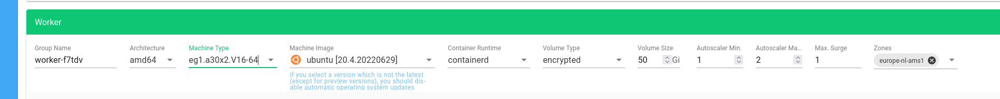

# Unlock the Potential of Private LLMs with Sustainable Power

Large language models (LLMs) are transforming the IT landscape, offering capabilities that were once science fiction. Public models like ChatGPT and Copilot showcase this potential, but for organizations with unique needs, data security concerns, and a focus on control, private LLMs offer a compelling advantage.

At Leafcloud, a leading sustainable cloud provider, we understand the environmental impact of LLMs is a growing concern. Training and running these models can be resource-intensive. That's why we champion sustainable practices like using waste heat from GPUs to power water heating systems. This innovative approach allows you to harness the power of LLMs while minimizing your environmental footprint.

## Why Consider a Private LLM?

Private LLMs offer several advantages:

- **Data Control and Privacy**: Keep your sensitive data in-house, ensuring regulatory compliance and mitigating risks of data breaches.
- **Cost Efficiency**: Predictable costs, potential economies of scale, and long-term savings compared to ongoing external service payments.
- **Customization**: Fine-tune the model with your proprietary data for enhanced accuracy and relevance to your specific needs. Seamless integration with existing systems using Retrieval-Augmented Generation (RAG) is also possible.


### Is Setting Up a Private LLM Right for You?

The good news is, setting up a private LLM has become more approachable thanks to a growing range of open-source tools and pre-trained models. While some technical expertise is still required, the process is no longer limited to just large organizations with extensive resources.

If you're intrigued by the potential of private LLMs and have a basic understanding of relevant technologies, don't be discouraged! This guide provides a roadmap to get you started. 

## The Setup 

Here's a breakdown of the tools and technologies involved in setting up your private LLM environment:

- **Managed Kubernetes Cluster with Gardener**: Gardener simplifies the creation and management of a Kubernetes cluster, which acts as the underlying platform for running your LLM model.
- **Ollama**: Ollama is an open-source tool specifically designed for running large language models efficiently within a Kubernetes environment.
- **AnythingLLM**: AnythingLLM provides a user interface and functionalities for interacting with your LLM model. It allows you to manage tasks, user access, and potentially fine-tune the model.
- **Ingress NGINX**: Ingress NGINX acts as a traffic director, routing incoming requests to the appropriate components within your LLM setup.
- **Certbot**: Certbot automates the management of SSL certificates, ensuring secure communication within your private LLM environment.
- **chromadb**: ChromaDB is an open-source database that stores LLM embeddings. It enables you to add documents to your LLM model, allowing you to customize the model's responses based on specific documents or contexts..

This combination of open-source tools provides a secure and customizable foundation for leveraging the power of private large language models.


## 1. Create a Managed Kubernetes Cluster using Gardener

To create a managed Kubernetes cluster using Gardener, follow these steps:
1. Log in to your Gardener dashboard at [https://dashboard.gardener.leaf.cloud]
2. Click on the + icon to start creating a new Kubernetes cluster.
   Under name give the cluster a suitable name, such as "llm-cluster". Infrastructure and dns
   settings can be left with default values.
3. Configure Worker Group: <br> In this section, select the machine type for your cluster. This decision will impact factors like budget, user load, and the size of the models you plan to run. Refer to the explanation above for considerations when choosing your machine type. For more complex worker group configurations, consult the Gardener documentation.

    Example:This tutorial will use Ollama with 2 replicas to run the Llama3 8B model (a relatively small model). A V100 or A30 machine with 2 GPUs is sufficient for this scenario. The image depicts selecting the appropriate machine type in the Gardener dashboard.  


Click on the "Create" button to create your cluster. This process can take several minutes depending on the size of the machine you selected. Once the cluster is created, it will be listed in your Gardener dashboard.

For more information on how to create a managed Kubernetes cluster using Gardener and working with gardenctl to manage your kubeconfig files, check the following tutorial: [Creating a Kubernetes Cluster](https://docs.leaf.cloud/en/latest/gardener/creating-a-kubernetes-cluster/).

## 2. Nvidia Drivers and CUDA Toolkit Installation

To utilize the GPUs with Ollama, we need to install the necessary drivers and CUDA toolkit on our Kubernetes nodes. This can be done using the Nvidia Kubernetes Operator. The operator automatically detects if a node has GPUs and installs the drivers. 
For detailed instructions, refer to the Nvidia documentation: [Nvidia GPU Operator](https://docs.nvidia.com/datacenter/cloud-native/gpu-operator/latest/index.html).

To install the operator, run:

```bash
kubectl create ns gpu-operator
kubectl label --overwrite ns gpu-operator pod-security.kubernetes.io/enforce=privileged
helm install --wait --generate-name -n gpu-operator --create-namespace nvidia/gpu-operator --set toolkit.enabled=true --version 23.6.2
```

It can take a few minutes before the operator is ready to use. You can check its status by running:
```bash
kubectl get pods -n gpu-operator
```

When all nvidea pods are successfully deployed, we can inspect our node to see if the operator has successfully detected the gpu and  installed the drivers and CUDA toolkit. 

To do so, run:  

```bash
kubectl describe nodes 
```

In the label section, you should see labels like this:

nvidia.com/gpu.count=2 <br>
nvidia.com/gpu.memory=24576<br>
nvidia.com/gpu.present=true<br>
nvidia.com/gpu.product=NVIDIA-A30<br>

In the resources sections the gpu should be listed<br>


## 3. Assigning Public Access 

To access your private LLM service and AnythingLLM from outside the Kubernetes cluster (optional), you'll need to create public hostnames. Subdomains act as unique addresses within a larger domain. Leafcloud allows you to create free subdomains under the `.domains.leaf.cloud` domain.

In this step, we'll create two subdomains:

- `ollama.testcompany.domains.leaf.cloud` - This will point to your Ollama service.
- `anything-llm.testcompany.domains.leaf.cloud` - This will point to the AnythingLLM interface.

### Creating Subdomains

For detailed instructions on creating subdomains in Leafcloud, refer to this tutorial: [Leafcloud Documentation](https://docs.leaf.cloud/)


# 4. Streamlined Installation with Helmfile

In this step, we'll focus on installing the necessary tools using Helm and Helmfile. Helm is a popular package manager for Kubernetes, and Helmfile helps us streamline the installation process by combining multiple Helm charts (think of them as pre-packaged configurations) into a single file (`helmfile.yaml`). This makes managing the installation and updates of various components much easier.

We'll highlight relevant sections of the `helmfile.yaml` file to demonstrate how Ollama and AnythingLLM are configured. The full version of this file can be found on our GitHub repository.

See here the installation instructions for helmfile:
[https://github.com/helmfile/helmfile]

## Helmfile Configuration

The `helmfile.yaml` file consists of two main sections:

### Repositories

In this example, we've specified public repositories for most tools except AnythingLLM. For AnythingLLM, we decided to use Gimlet's onchart, which is a really nice and easy chart to use for generic applications.


```yaml
repositories:
  - name: nginx-stable
    url: https://helm.nginx.com/stable
  - name: jetstack
    url: https://charts.jetstack.io
```


### Releases

This section defines individual software deployments using Helm charts. Here, we'll see how Ollama and AnythingLLM are configured, including details like chart versions, namespaces, and values files (which can hold specific configuration options).

```yaml
releases:
 - name: ollama
   namespace: anything-llm
   chart: ollama-helm/ollama
   labels:
     app: ollama
   createNamespace: true
   version: "0.29.1"
   values: [ "./ollama.yaml" ]
```


## Configuring Ollama and AnythingLLM
While most of the Ollama configuration in the helmfile.yaml file is straightforward, here are some key points to highlight:

Ingress Configuration:  For both Ollama and AnythingLLM, you'll need to set up the correct hostname in the ingress section. 


### Ollama Specific Settings:

- **GPU Support:** We've enabled GPU support in the Ollama configuration, assuming your cluster has GPUs available. This allows the model to leverage the processing power of GPUs for faster performance.
- **Model Selection:** The configuration specifies the particular model to be used by Ollama. This model will be downloaded automatically when you first start the Ollama service.
- **Persistence:** Persistence is enabled to ensure the downloaded model is not lost when pods restart. This means the model is stored on a persistent volume and shared between all Ollama replicas, improving efficiency.


```yaml
ollama:
  gpu:
    enabled: true
    models:
    - llama3
persistentVolume:
  enabled: true
  size: 100Gi

```

## Advanced: Running Multiple Models Concurrently (Optional)

Starting with Ollama version 0.1.33, you can run and respond to queries using multiple large language models simultaneously. This is useful if you have different models for various tasks.

### Enabling Multi-Model Support

Add these environment variables to your `helmfile.yaml` file:

```yaml
extraEnv:
  - name: OLLAMA_NUM_PARALLEL
    value: "3"
  - name: OLLAMA_MAX_LOADED_MODELS
    value: "3"
```


## Installing.

T