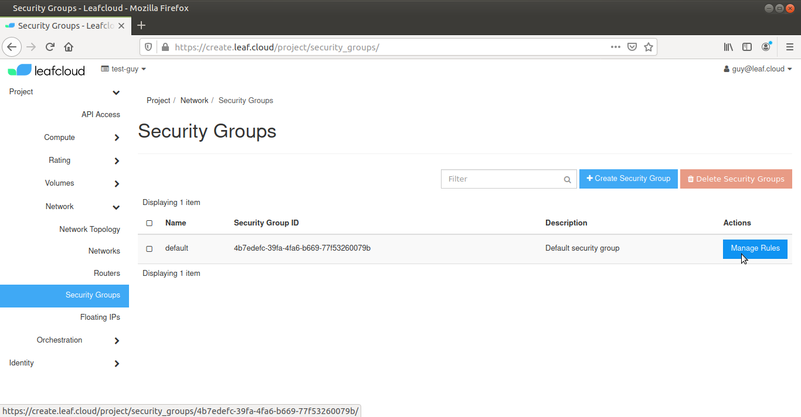
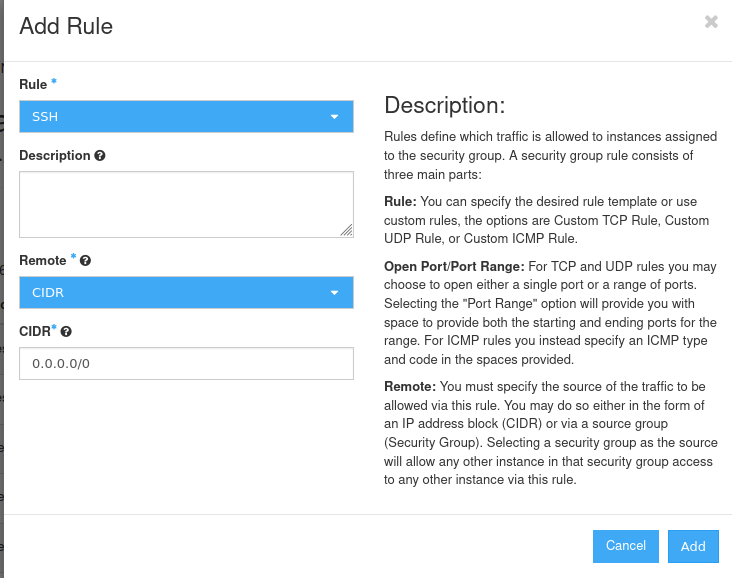
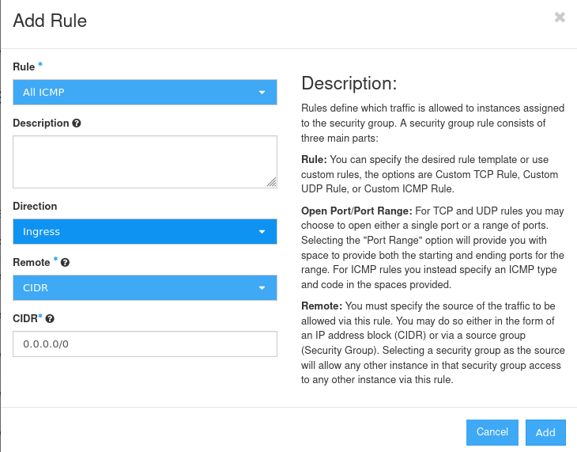

# Configuring secure access

This tutorial will walk you through Security Groups and IP rules

## Security Groups

Configuring your security groups allows you to determine what traffic can access which port on your instance

### Enabling SSH and ICMP

In this tutorial we will add rules to the existing *Default security group* that will enable SSH and ICMP access to your instance

Navigate to *Project > Network*, then click on *Security Groups*

The available security groups for this project are now displayed, select the group with the *Default security group* description and click *Manage Rules* on the right

Click on *Add Rule*

Select *SSH* from the Rule dropdown list, make sure the Remote is set to *CIDR* and fill in *0.0.0.0/0*

Click *Add*

You have now added a rule to the Security Group

click *Add Rule* again

Select *All ICMP* from the Rule dropdown list 

Make sure the *Direction* is set to *Ingress*, the *Remote* is set to *CIDR* and fill in *0.0.0.0/0*

click *Add*

You can now access your instance by SSH and ICMP
