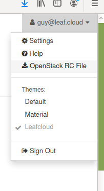

# How to use the Openstack CLI

This tutorial explains how work on a project using the Openstack CLI tools 

### Installing the Openstack CLI

To get started, install the Openstack CLI by entering the following command:

```
 sudo apt update
 sudo apt install -y python3-pip python3-dev
 sudo pip3 install --upgrade pip
 sudo pip3 install python-openstackclient
 ```


### Install the configuration file

Log in to your Leafcloud account, click on your user name and download the *OpenStack RC File*



Copy, then paste the contents of the file into a new text document i.e.

``` shell
 ~/.leafcloudopenrc.sh
```

Now, run the following to use the configuration file:

``` shell
source ~/.[File name].sh
```

Enter your password, you have now gained access to the Openstack CLI 

### Making a new server using CLI

To create a server using the Openstack CLI, start by creating a new key pair

``` shell
keypair create [keyname]
```
For example:

``` shell
keypair create clitest_key
```

To make sure the key has been created successfully, look it up in the key pair list like this:

``` shell
keypair list
```

Next, list the possible images and flavors by entering the following:

``` shell
image list
flavor list
```

To create your new server now use:

``` shell
server create clitest --image [image name] --flavor [instance type] --key-name [keyname] --network public
```
For our test server that looks like this:

``` shell
server create clitest --image cirros 0.5.1 --flavor ec1.small --keyname clitest_key --network public
```

You have now created a server using Openstack CLI
