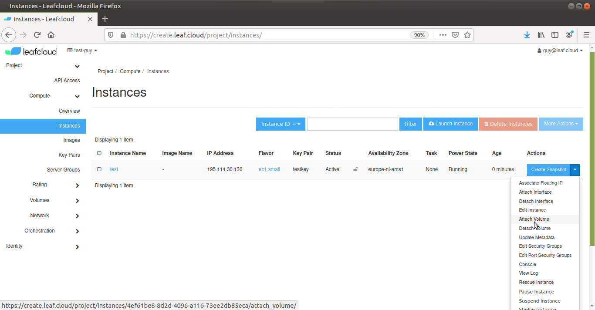

# Attaching a Volume

Before attaching a volume to an instance, you need to create both a volume and an instance, instructions for which you can find in the related tutorials

Navigate to *Project > Instances*

Select the instance you want to add a volume to

Click on the *Actions* dropdown menu on the right

Select *Attach Volume*

Select the volume you want to attach from the *Volume ID* dropdown menu, then click *Attach Volume*

You have now attached a volume to your instance
