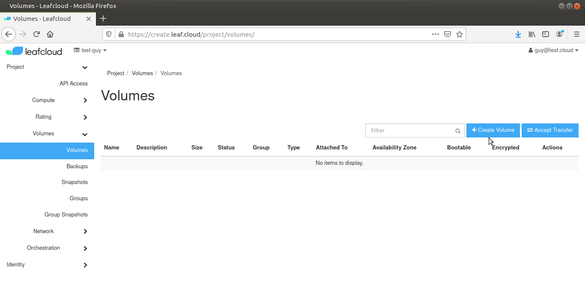
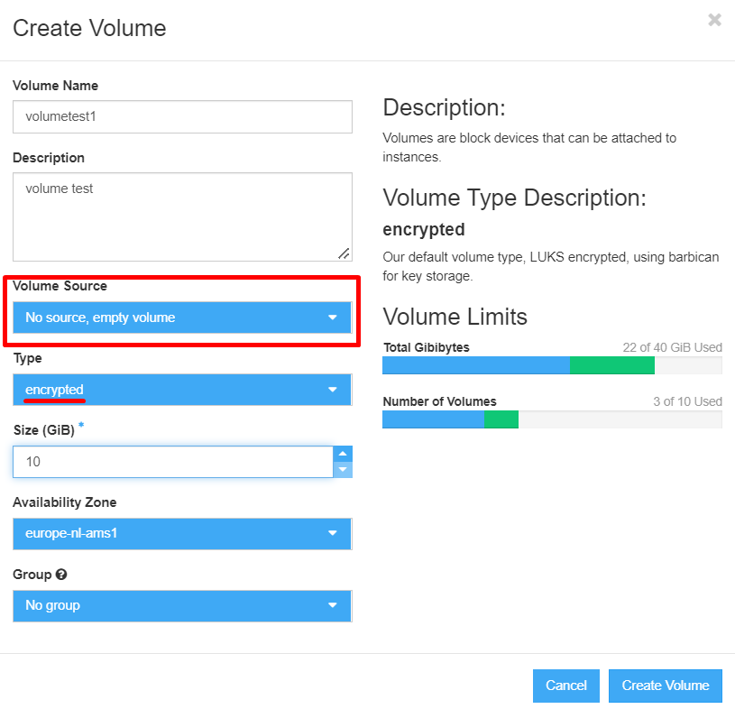

# Creating a new volume

In this tutorial we will create a bootable Volume, using an image as the source

Navigate to *Project > Volumes*

Click *Create Volume* on the right

Give your new volume a name (i.e. volumetest1) and add a description

Select the *Volume Source* from the dropdown menu, depending on the type of volume you wish to make

Select the size of the volume, for our bootable volume example, set *Size (GiB) to 10, which is the minimum required for a Linux bootable volume 

Set the *Availability Zone* and *Group* that the volume belongs to (in the case of our example, make sure *Group* is set to *No group*)

Click Create Volume

You have now created a new volume
