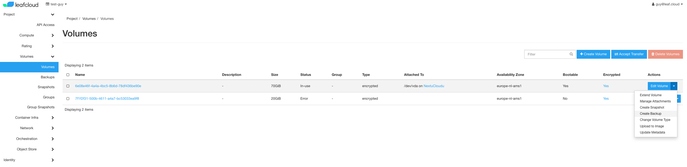
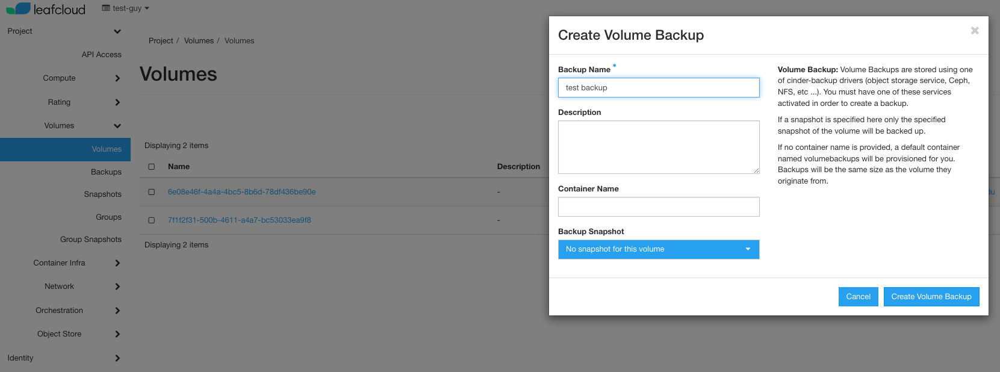
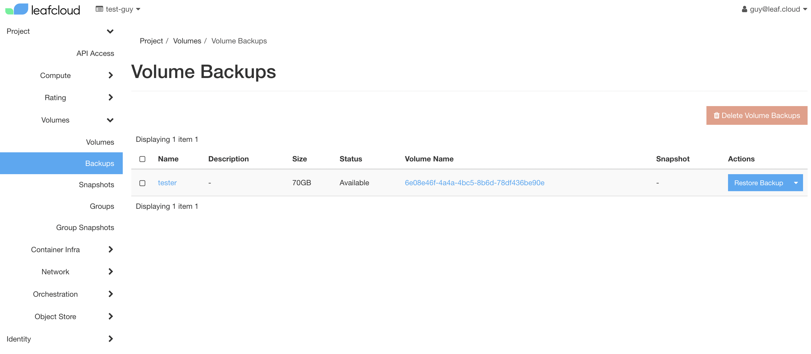

# Creating a volume backup

This tutorial will explain how to create a backup of your volume, both by using the Openstack CLI or the Horizon dashboard. Creating a backup of your volume is important. Knowing that your data is backed up provides peace of mind, allowing you to focus on other things without worrying about data loss due to software malfunction, or other unforeseen circumstances. Besides, your businesses may require you to back up their data to comply with legal and regulatory requirements.

## Using the Openstack CLI

Open terminal and run the following:

```
openstack volume backup create <volume-id> --force
-------+ (openstack_env) <id> openstack volume backup create <volume-id> --force
+-------+--------------------------------------+
| Field | Value                                |
+-------+--------------------------------------+
| id    | 2ac93a23-667d-4b4f-a7ba-d1778c3c21d0 |
| name  | None                                 |
+-------+--------------------------------------+

```
```
openstack volume backup show 2ac93a23-667d-4b4f-a7ba-d1778c3c21d0
```

## Using the Horizon dashbaord

Navigate to the Volumes tab and select the volume you would like to back up. Next, select çreate backup' from the dropdown menu on the right.



Give your backup a name, description, and name the container it is placed in. 



Volume Backups are stored using one of cinder-backup drivers (object storage service, Ceph, NFS, etc ...). You must have one of these services activated in order to create a backup.

If a snapshot is specified here only the specified snapshot of the volume will be backed up.

If no container name is provided, a default container named volumebackups will be provisioned for you. Backups will be the same size as the volume they originate from.

Now, navigate to Backups on the right. Here you wil find the newly created volume backup.



