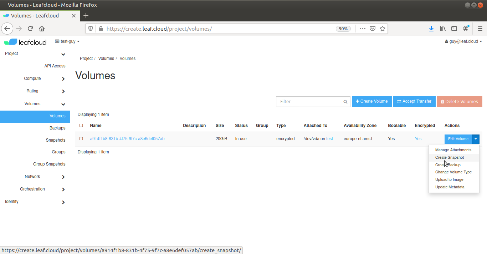
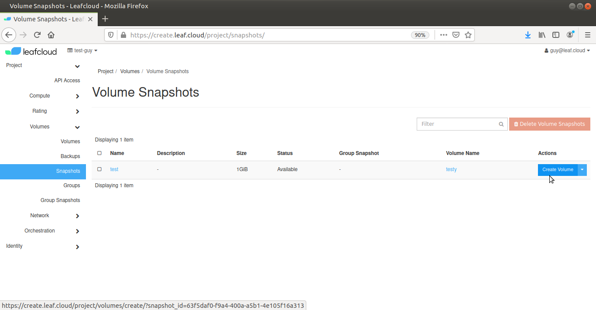

# Making a Volume Snapshot

Navigate to *Project > Volumes*

Select the volume you want to make a snapshot of and click on *Create Snapshot* in the *Actions* dropdown menu

Give your snapshot a name and add a description

Click on *Create Snapshot*

Note that you should snapshot an unattached volume, as creating a snapshot from an attached volume can result in a corrupted snapshot

You have now made a snapshot of your volume

## Restoring your volume snapshot

Navigate to *Volumes > Snapshots*

Select the snapshot you want to restore and click *Create Volume on the right

Give your new volume a name and adjust the size as group as required

Click *Create Volume*. You will be redirected to *Volumes*, once the new volume has been created

You have now restored a volume from your snapshot

